# SAG-E 개발 가이드

**Schema-Augmented Generation & Execution** — LLM·MCP 기반 데이터 통합, 도구 생성, 보고서 codegen·실행 프레임워크.

> 상위 개요·설치: [README.md](../README.md)

문서 내 **mermaid 다이어그램** — 시스템 아키텍처, 기동 순서, SSE·exec·MCP 흐름, NodeV 루프, Pangea/Report 파이프라인 등.

### 다이어그램 보는 방법 (Cursor)

| 방법 | 설명 |
|------|------|
| **확장 설치 (권장)** | Extensions → `Markdown Preview Mermaid Support` (bierner) 설치 → `Ctrl+Shift+V` 미리보기 |
| **GitHub** | repo에 push 후 `.md` 파일 열면 mermaid 자동 렌더 |
| **Mermaid Live** | [mermaid.live](https://mermaid.live) 에 코드 블록 붙여넣기 |

> Cursor **채팅/Plan** 안의 mermaid는 그려지지만, **일반 `.md` 미리보기**는 기본적으로 코드 블록만 보입니다. 그림이 “안 나오는” 것이 문법 오류가 아니라 **미리보기 기능 부재**인 경우가 많습니다.

---

## 용어

| 용어 | 설명 |
|------|------|
| **SAG-E** | 스키마 정보를 활용해 LLM으로 분석·보고서 소스를 생성·실행하는 방법론 |
| **MCP** | Model Context Protocol — LLM이 외부 도구·데이터에 연결하는 표준 프로토콜 |
| **Node (NodeV)** | Pydantic 입출력 + `instruction.md` + LLM codegen 루프를 갖춘 실행 단위 |
| **도구 (Tool)** | FastMCP 기반 Python `main.py` + 자연어 호출용 `caller.py` |
| **Pangea** | 멀티 소스를 통합 스키마(`did-*`)로 등록·갱신하는 데이터 파이프라인 |
| **Report** | Plan DAG → 태스크 codegen → 병렬 실행 → layout/release 산출물 |
| **Control plane** | LLM codegen·validator·DB·SSE — API 프로세스 (`8090`) |
| **Data plane** | LLM이 생성한 `.py` 실행 — Docker exec worker pool |
| **TaskContext** | 태스크 간 JSON 칠판 — `dump/{plan_hex}/context.json` |
| **assetize** | `tm-*` generated 도구를 `kis/stock` 등 namespace 경로로 승격, MCP HTTP mount |

---

## 시스템 아키텍처

### Control plane / Data plane / MCP

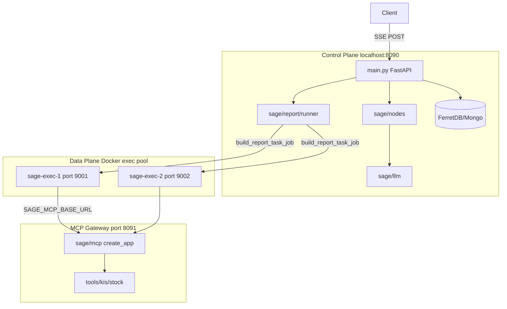
```mermaid
flowchart TB
    subgraph CP["Control Plane localhost:8090"]
        API["main.py FastAPI"]
        LLM["sage/llm"]
        NodeV["sage/nodes"]
        Report["sage/report/runner"]
        DB[("FerretDB/Mongo")]
    end

    subgraph DP["Data Plane Docker exec pool"]
        W1["sage-exec-1 port 9001"]
        W2["sage-exec-2 port 9002"]
    end

    subgraph MCPGW["MCP Gateway port 8091"]
        GW["sage/mcp create_app"]
        Tools["tools/kis/stock"]
    end

    Client -->|SSE POST| API
    API --> NodeV --> LLM
    API --> Report
    Report -->|build_report_task_job| W1
    Report -->|build_report_task_job| W2
    W1 -->|SAGE_MCP_BASE_URL| GW
    W2 --> GW
    GW --> Tools
    API --> DB
```

| 구분 | 역할 | 주요 경로 |
|------|------|-----------|
| **Control plane** | codegen, validator, Mongo persist, SSE | `main.py`, `routers/`, `sage/nodes/`, `sage/report/` |
| **Data plane** | 생성된 Python만 실행 | `docker-compose.exec.yml`, `sage/exec/` |
| **MCP gateway** | assetized 도구 HTTP 노출 | `sage/mcp/server.py` (별도 Process), `:8091` |

**원칙:** *생성은 control plane, 실행은 data plane.* Worker는 LLM API key·Mongo URL·`.env`를 받지 않습니다.

### 프로세스·포트

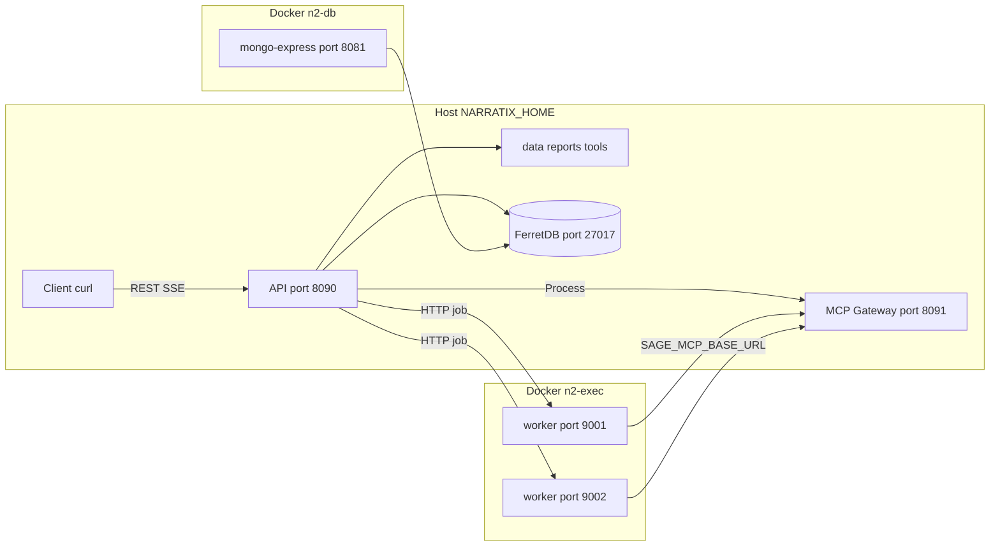
```mermaid
flowchart LR
    subgraph Host["Host NARRATIX_HOME"]
        C["Client curl"]
        API["API port 8090"]
        MCP["MCP Gateway port 8091"]
        FS["data reports tools"]
        FDB[("FerretDB port 27017")]
    end

    subgraph Docker["Docker n2-exec"]
        W1["worker port 9001"]
        W2["worker port 9002"]
    end

    subgraph DockerDB["Docker n2-db"]
        ME["mongo-express port 8081"]
    end

    C -->|REST SSE| API
    API --> FDB
    API --> FS
    API -->|Process| MCP
    API -->|HTTP job| W1
    API -->|HTTP job| W2
    W1 -->|SAGE_MCP_BASE_URL| MCP
    W2 --> MCP
    ME --> FDB
```

| 포트 | 프로세스 | 설명 |
|------|----------|------|
| **8090** | `python main.py` (uvicorn) | REST API, SSE, codegen |
| **8091** | `sage/mcp/server.py` (자식 Process) | MCP HTTP 게이트웨이 |
| **9001/9002** | Docker worker daemon | exec pool (`n2-exec`) |
| **8081** | mongo-express | FerretDB UI (`n2-db`) |

`main.py` startup 시 MCP 자식 프로세스 기동 + exec warm pool restart(`docker_pool.restart_workers`)가 수행됩니다.

### main.py · cfg.py

**`cfg.py`** (import 시점)

- `root_path` ← `NARRATIX_HOME` (미설정 시 `cfg.py` 위치)
- `nodes_path` ← `SAGE_NODES_PATH` (기본 `./nodes`)
- `uploads/`, `dump/`, `runs/`, `tools/` 디렉터리 자동 생성
- `sage_exec_driver=docker_pool` (in-process exec fallback 없음)
- `sage_mcp_base_url` — worker→host MCP URL (비어 있으면 `localhost:8091`)
- `sage_mcp_bind_host` — docker_pool 기본 **`0.0.0.0`** (worker가 `host.docker.internal`로 접근)

**`main.py`** 기동 순서

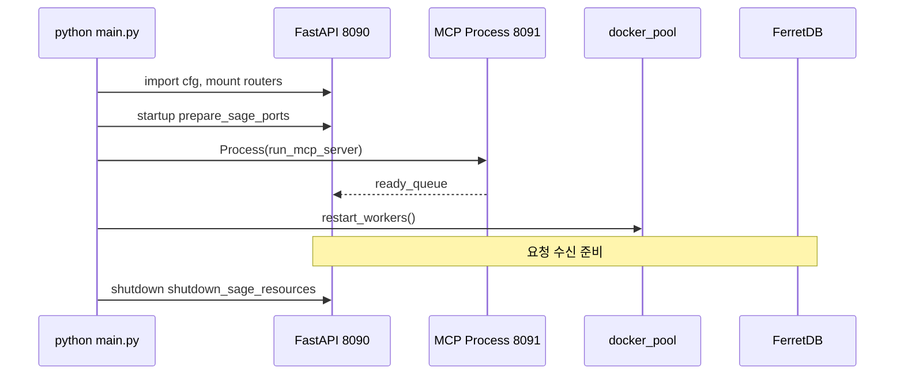
```mermaid
sequenceDiagram
    participant U as python main.py
    participant API as FastAPI 8090
    participant MCP as MCP Process 8091
    participant Pool as docker_pool
    participant DB as FerretDB

    U->>API: import cfg, mount routers
    U->>API: startup prepare_sage_ports
    U->>MCP: Process(run_mcp_server)
    MCP-->>API: ready_queue
    U->>Pool: restart_workers()
    Note over API,DB: 요청 수신 준비
    U->>API: shutdown shutdown_sage_resources
```

1. `.env` 로드, `NARRATIX_HOME` → `sys.path`
2. FastAPI 앱 + `verify_api_key` Depends (전역)
3. 라우터 마운트: `/data`, `/report`, `/tool`, `/secret`
4. **startup** `prepare_sage_ports` — 포트 점유 정리 (`sage/serve`)
5. **startup** `trigger_mcp` — MCP 게이트웨이 별도 `Process` (`sage/mcp/server.py`, `:8091`)
6. **startup** `_warmup_exec_pool` — `docker_pool.restart_workers()` (코드·daemon 동기)
7. **shutdown** `shutdown_sage_resources` — MCP 프로세스·exec pool 정리

```python
# routers 마운트 (main.py)
api.include_router(data.router, prefix="/data", tags=["Data"])
api.include_router(report.router, prefix="/report", tags=["Report"])
api.include_router(tool.router, prefix="/tool", tags=["Tool"])
api.include_router(secret.router, prefix="/secret", tags=["Secret"])
```

---

## 프로젝트 구조

```
.
├── main.py                 # FastAPI 진입 (8090) + MCP 게이트웨이 프로세스 (8091)
├── cfg.py                  # root_path, host/port, exec/MCP env, 디렉터리 bootstrap
├── routers/                # REST API (SSE → EventSourceResponse)
│   ├── data.py             # /data — upload, pangeaze, list, view
│   ├── report.py           # /report — generate, exec, publish, update
│   ├── tool.py             # /tool — generate, exec, assetize
│   ├── secret.py           # /secret — API 키 등록
│   └── base.py             # APIResponse, SSEEncoder
├── sage/                   # 코어 라이브러리 (아래 § sage/ 코어 모듈 참고)
├── nodes/                  # LLM 노드 (instruction.md + validated.md + main.py)
│   ├── .prompts/           # 공유 프롬프트 조각 (runtime, echarts_spec, brief …)
│   ├── data/pangeaze/      # 통합 스키마 codegen
│   ├── report/plan/        # 보고서 Plan DAG
│   ├── report/task/{data,analyze,visual,narrative,release}/
│   └── tool/{generator,executor,update}/
├── tools/                  # MCP 도구 (generated → assetized)
├── data/{did}/             # Pangea 데이터셋
├── reports/{rid}/          # plan.json, srcs/*.py, report.json
├── runs/                   # published 보고서 실행 기록
├── uploads/                # 업로드 임시 파일
├── dump/                   # TaskContext (plan hex별 context.json)
├── resources/              # 샘플 CSV
├── docker-compose.yml      # DB (project: n2-db)
└── docker-compose.exec.yml # Exec pool (project: n2-exec)
```

### 런타임 산출물

| 경로 | 내용 |
|------|------|
| `data/{did}/pangea/v1/` | schema.py, adapter.py, unify.py, targets/*.parquet |
| `reports/{rid}/srcs/` | codegen된 `async def run_task(...)` |
| `reports/{rid}/.exec/` | exec job progress/result JSON |
| `dump/{plan_hex}/context.json` | TaskContext 칠판 |
| `tools/tm-*` | generated 도구 (assetize 전) |
| `tools/kis/stock/` 등 | assetized MCP 도구 |
| `logs/sage.log` | 전역 상세 로그 |
| `logs/report/rp-*.log` | report별 prompt·SSE dump |

---

## API 레이어 (`routers/`)

REST 핸들러는 **동기 JSON** 또는 **SSE 스트림** 두 패턴으로 나뉩니다. 공통 타입은 `routers/base.py`.

| 라우터 | Prefix | 핵심 엔드포인트 | SSE |
|--------|--------|-----------------|-----|
| `data.py` | `/data` | upload, **pangeaze**, pangeaze/update, list/query, view | pangeaze, update |
| `report.py` | `/report` | **generate**, update, publish, exec, list/query | generate, update, exec |
| `tool.py` | `/tool` | generate, update, exec, assetize | generate, update |
| `secret.py` | `/secret` | register, list, delete | — |
| `base.py` | — | `APIResponse[T]`, **`SSEEncoder`** | 공통 |

### REST 응답 (`APIResponse`)

```json
{ "success": true, "error": null, "result": { ... } }
```

실패 시 `success: false`, `error`에 메시지. Pydantic validator가 `success=False`면 `sage/logg.error`로 자동 로깅.

### SSE 핸들러 패턴

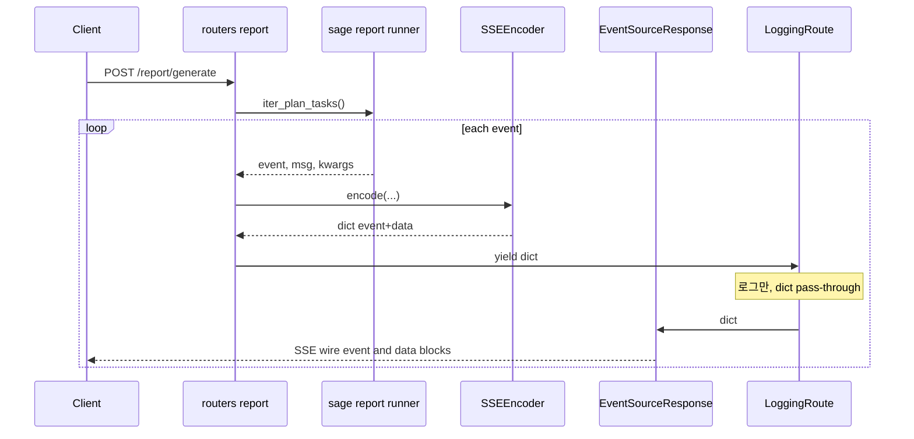
```mermaid
sequenceDiagram
    participant Client
    participant Router as routers report
    participant Runner as sage report runner
    participant Enc as SSEEncoder
    participant ESR as EventSourceResponse
    participant Log as LoggingRoute

    Client->>Router: POST /report/generate
    Router->>Runner: iter_plan_tasks()
    loop each event
        Runner-->>Router: event, msg, kwargs
        Router->>Enc: encode(...)
        Enc-->>Router: dict event+data
        Router->>Log: yield dict
        Note over Log: 로그만, dict pass-through
        Log->>ESR: dict
        ESR-->>Client: SSE wire event and data blocks
    end
```

```python
async def handle_report_generation(req: ReportGenerateReq):
    async def event_stream():
        async for ev in runner.iter_plan_tasks(...):
            yield SSEEncoder.encode(ev["event"], ev["msg"], **ev.get("kwargs", {}))
    return EventSourceResponse(event_stream())
```

- 핸들러는 **dict** `{event, data}` yield — `EventSourceResponse`가 wire 변환
- `LoggingRoute`는 dict를 **변형하지 않음** (로그만)
- `completed` payload는 클라이언트용으로 슬림화 (`_client_report_payload` — 전체 dataset `data` 제외)

### report.py 주요 내부 함수

| 함수 | 역할 |
|------|------|
| `handle_report_generation` | generate SSE generator |
| `handle_report_update` | PATCH update — downstream closure 재생성 |
| `_client_report_payload` | SSE completed용 report.json 요약 |

---

## sage/ 코어 모듈

핵심 패키지입니다. **import 경로 = `sage.<pkg>`**.

### 패키지 맵

| 패키지 | 핵심 파일 | 책임 |
|--------|-----------|------|
| **`sage/nodes/`** | `framework.py`, `factory.py`, `validated_md.py`, `lesson_learn.py` | NodeV LLM 루프, validator, `validated.md` 학습 |
| **`sage/report/`** | `runner.py`, `context.py`, `layout.py`, `validators.py`, `task_shell.py` | 보고서 plan→codegen→exec→collect |
| **`sage/llm/`** | `llms.py`, `usage.py`, `pricing.py`, `prompt_telemetry.py` | Gemini/GPT/Claude/Cursor, attach·usage |
| **`sage/prompt/`** | `enrich.py`, `report_prompts.py`, `dataset.py`, `core.py` | EnrichRule, runtime contract, dataset attach |
| **`sage/mcp/`** | `client.py`, `server.py` | FastMCP client(세션 풀) + HTTP gateway(mount) |
| **`sage/data/`** | `pangea.py`, `metadata.py`, `schema_contract.py`, `bridge.py` | Pangea unify, parquet, schema 검증 |
| **`sage/tool/`** | `runtime.py`, `assetize.py`, `metadata.py` | caller exec, assetize, smoke test |
| **`sage/exec/`** | `runtime.py`, `jobs.py`, `docker_pool.py`, `worker_core.py`, `daemon.py` | Docker 격리 exec (단일 진입 `run_exec_job`) |
| **`sage/db/`** | `store.py` | FerretDB/Mongo `SAGEDataStore` |
| **`sage/models/`** | `doc.py`, `node.py`, `req.py`, `tool.py` | Pydantic 도메인·API 요청 |
| **`sage/auth/`** | `api_key.py` | `SAGE_API_KEY` REST 인증 |
| **`sage/secret/`** | `crypto.py`, `keys.py` | Fernet API 키 (tool codegen attach) |
| **`sage/serve/`** | `server.py` | uvicorn bind, 포트 점유 정리 |
| **`sage/logg.py`** | `LoggingRoute` | REST·SSE 로깅 (SSE dict pass-through) |
| **`sage/config.py`** | — | `NARRATIX_HOME` 해석 (Windows↔Docker `/host/n2`) |

### report/ 하위 (보고서 파이프라인)

리포트 실행 및 llm 사후 검증용 패키지

| 파일 | 역할 |
|------|------|
| `runner.py` | `iter_plan_tasks`, `codegen_task`, `run_task_code`, `collect_report_result` |
| `context.py` | `TaskContext`, `TaskInfo`, `load`/`catalog`/`to_dict` |
| `task_codegen.py` | `TaskCodegenNode` — 타입별 NodeV thin wrapper |
| `task_shell.py` | LLM body → prelude + `async def run_task(...)` 조립 |
| `task_prelude.py` | import·reporter·ctx API prelude |
| `validators.py` | AST validator — MCP allow-list, upstream board, Pangea schema |
| `codegen_contract.py` | data/analyze/visual 공통 executor 규칙 (markdown) |
| `release_contract.py` | release 전용 — `apply_upstream_patches` 필수 |
| `plan_tools.py` | MCP path merge, `normalize_mcp_tool_path` |
| `layout.py` | `layout` + `data` 분리 report JSON, block registry |
| `upstream_sources.py` | narrative snippet ↔ upstream 출처 |
| `quality.py`, `meta.py` | 품질 루브릭·메타 |

### exec/ 하위 (격리 실행)

| 파일 | 역할 |
|------|------|
| `runtime.py` | **`run_exec_job()`** — docker_pool only, progress tail |
| `jobs.py` | `build_report_task_job`, `build_pangea_unify_job`, `build_tool_caller_job` |
| `drivers/docker_pool.py` | warm pool, slot acquire/release, stall fail-fast |
| `daemon.py` | worker 컨테이너 HTTP `:9000` |
| `worker_core.py` | `execute_report_task_job` — env 적용, `run_task` import |
| `models.py` | `ExecJob`, `ExecResult`, progress/result 파일 경로 |

자세한 Job 계약·Docker 설정: [exec-isolation.md](exec-isolation.md)

---

## DB · Models · Auth

### FerretDB (`sage/db/store.py`)

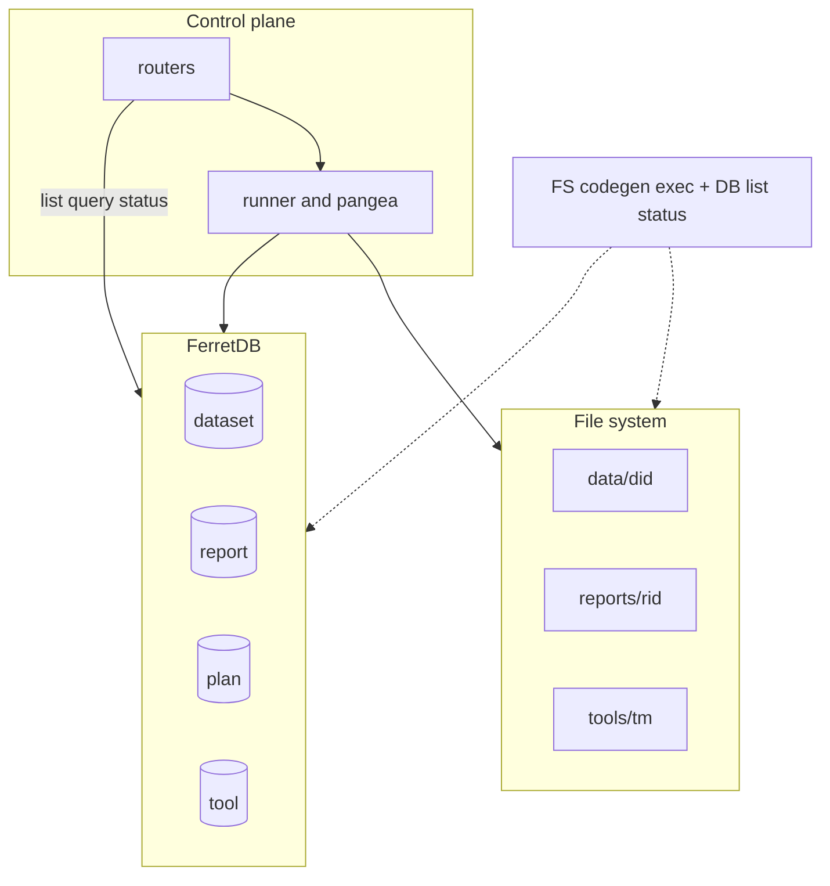
```mermaid
flowchart TB
    subgraph APIPlane["Control plane"]
        R[routers]
        RUN["runner and pangea"]
    end

    subgraph FS["File system"]
        DATA["data/did"]
        REP["reports/rid"]
        TOL["tools/tm"]
    end

    subgraph DBBlock["FerretDB"]
        DS[("dataset")]
        RP[("report")]
        PL[("plan")]
        TL[("tool")]
    end

    R --> RUN
    RUN --> FS
    RUN --> DBBlock
    R -->|list query status| DBBlock
    META["FS codegen exec + DB list status"]
    META -.-> FS
    META -.-> DBBlock
```

MongoDB 호환 API — `docker compose up -d`로 FerretDB + Postgres backend 기동.

| 컬렉션 prefix | 문서 타입 | 예 ID |
|---------------|-----------|-------|
| `dataset` | Pangea 데이터셋 메타 | `did-*` |
| `report` | 보고서 상태·generation 메타 | `rp-*` |
| `plan` | Plan DAG 스냅샷 | `pl-*` |
| `tool` | generated/assetized 도구 | `tm-*` |
| `task` | 태스크 실행 기록 | — |
| `session` | LLM 세션 (선택) | — |

- `SAGEDataStore` — async Motor wrapper, CRUD + list/query
- `get_db()` — FastAPI dependency 또는 startup singleton
- 파일 시스템(`data/`, `reports/`)과 DB는 **이중 기록** — exec·codegen은 FS, 목록·상태는 DB

### Pydantic 모델 (`sage/models/`)

| 파일 | 주요 타입 |
|------|-----------|
| `doc.py` | `DatasetDoc`, `ReportDoc`, `ToolDoc`, `PlanDoc` |
| `node.py` | `ReportPlanOutput`, `PlanTask`, `TaskRun`, `TaskOutput` |
| `req.py` | `ReportGenerateReq`, `PangeazeReq`, `ToolGenerateReq` … |
| `tool.py` | `ToolPack`, `ToolExecResult`, `ToolMetadata` |

Plan·Task 스키마는 codegen validator와 **동일 모델**을 공유합니다 (`PlanStructureValidator`).

### 인증 (`sage/auth/api_key.py`)

- `SAGE_API_KEY` 비어 있음 → 인증 **비활성** (로컬 기본)
- 설정 시: `API-Key` 헤더 또는 `Authorization: Bearer`(단, `/admin/*` 제외) 또는 SSE `?api_key=`
- 면제: `GET /`, `GET /docs`, `GET /openapi.json`, **`/admin/*`** (관리 UI는 JWT·쿠키 인증 별도)
- MCP `:8091`은 별도 (향후 동일 키 적용 예정)

### Admin 인증 (`sage/admin/auth.py`)

- `/admin/auth/login` → JWT를 HttpOnly 쿠키(`sage_admin_token`) 또는 `Authorization: Bearer`로 후속 요청
- `SAGE_ADMIN_JWT_SECRET`, `SAGE_ADMIN_TOKEN_TTL_HOURS` (`.env.example` 참고)
- **`SAGE_API_KEY`와 분리** — admin 라우트는 global API Key 검사 면제

### Secret (`sage/secret/`)

- Fernet으로 provider API 키 암호화 저장 (`POST /secret/register` → `sk-*`)
- tool codegen 시 `secret_id` attach — **worker env에는 주입하지 않음** (control plane attach만)

---

## sage/data/ (Pangea 레이어)

| 파일 | 역할 |
|------|------|
| `pangea.py` | unify orchestration, schema load, MCP lazy refresh, SSE yield |
| `metadata.py` | `PangeaMetadataDoc`, parquet 경로, version `v{n}` |
| `schema_contract.py` | codegen validator용 schema 필드·제약 |
| `schema_types.py` | `PangeaExDataFrame`, 타입 캐스팅·nullable 규칙 |
| `dump_store.py` | MCP field dump JSON (TTL backward 갱신) |
| `bridge.py` | `InMemoryDataBridge` — unify exec 중간 버퍼 |
| `kiwoom.py` | Kiwoom API adapter (선택 소스) |

**Forward / Backward**

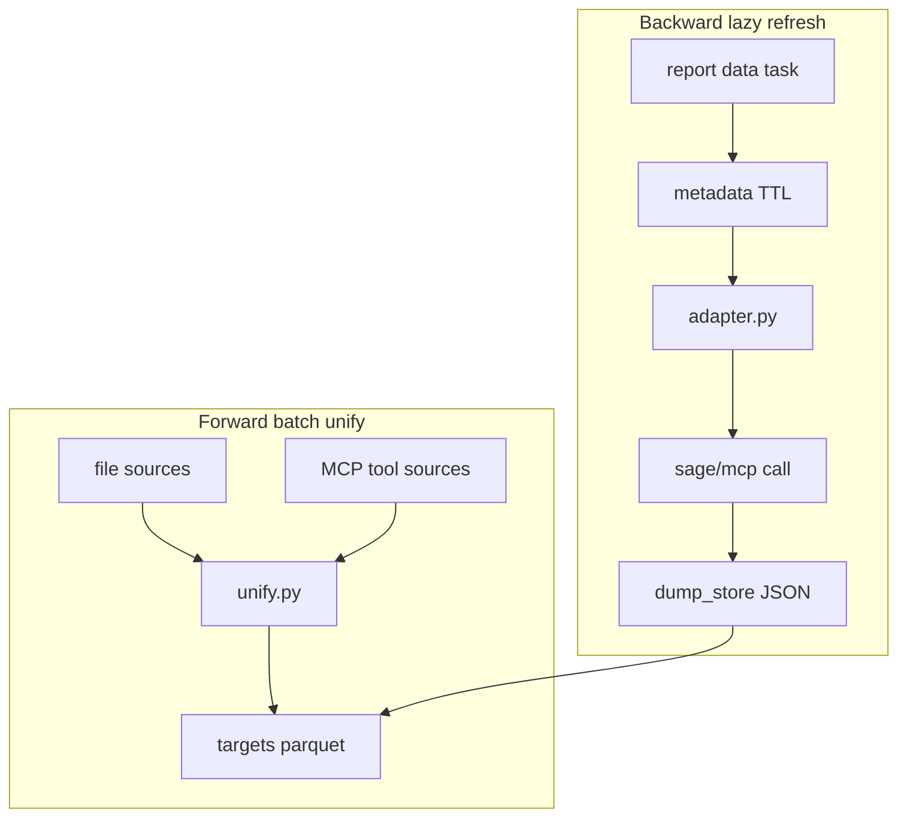
```mermaid
flowchart TB
    subgraph Forward["Forward batch unify"]
        S1[file sources] --> U[unify.py]
        S2[MCP tool sources] --> U
        U --> P["targets parquet"]
    end

    subgraph Backward["Backward lazy refresh"]
        RT[report data task] --> M[metadata TTL]
        M --> AD[adapter.py]
        AD --> MC["sage/mcp call"]
        MC --> DS[dump_store JSON]
        DS --> P
    end
```

- **Forward:** `unify.py` 배치 실행 → `targets/{Model}/*.parquet`
- **Backward:** report `data` 태스크 실행 시 `metadata.json` TTL + MCP로 lazy 갱신
- `metadata_tool_paths()` — dataset의 `type=tool` sources → report plan `tools[]` 자동 merge

---

## NodeV · LLM · Prompt

### nodes/ 트리 (NodeV 정의)

각 노드 = `instruction.md` + (선택) `validated.md` + `main.py` (`@node` 데코레이터).

| 경로 | Node ID | 용도 |
|------|---------|------|
| `nodes/report/plan/` | `report/plan` | Plan DAG JSON (`ReportPlanOutput`) |
| `nodes/report/task/data/` | `report/task/data` | data 태스크 codegen |
| `nodes/report/task/analyze/` | `report/task/analyze` | analyze 태스크 codegen |
| `nodes/report/task/visual/` | `report/task/visual` | visual (echarts) codegen |
| `nodes/report/task/narrative/` | `report/task/narrative` | narrative markdown codegen |
| `nodes/report/task/release/` | `report/task/release` | release — layout·patches |
| `nodes/report/update/` | `report/update` | 보고서 수정 plan diff |
| `nodes/data/pangeaze/` | `data/pangeaze` | schema + adapter + unify codegen |
| `nodes/data/analyze/` | `data/analyze` | (레거시) 소스 분석 |
| `nodes/data/unify/` | `data/unify` | (레거시) unify 단독 |
| `nodes/tool/generator/` | `tool/generator` | MCP `main.py` + `caller.py` 생성 |
| `nodes/tool/executor/` | `tool/executor` | NL → caller 인자 매핑 |
| `nodes/tool/update/` | `tool/update` | 도구 수정 codegen |
| `nodes/.prompts/report/` | — | **공유 조각** — runtime contract, echarts, brief |

`NodeFactory.get("report/plan")` → `cfg.nodes_path / "report/plan"` 로드.

### NodeV 실행 루프

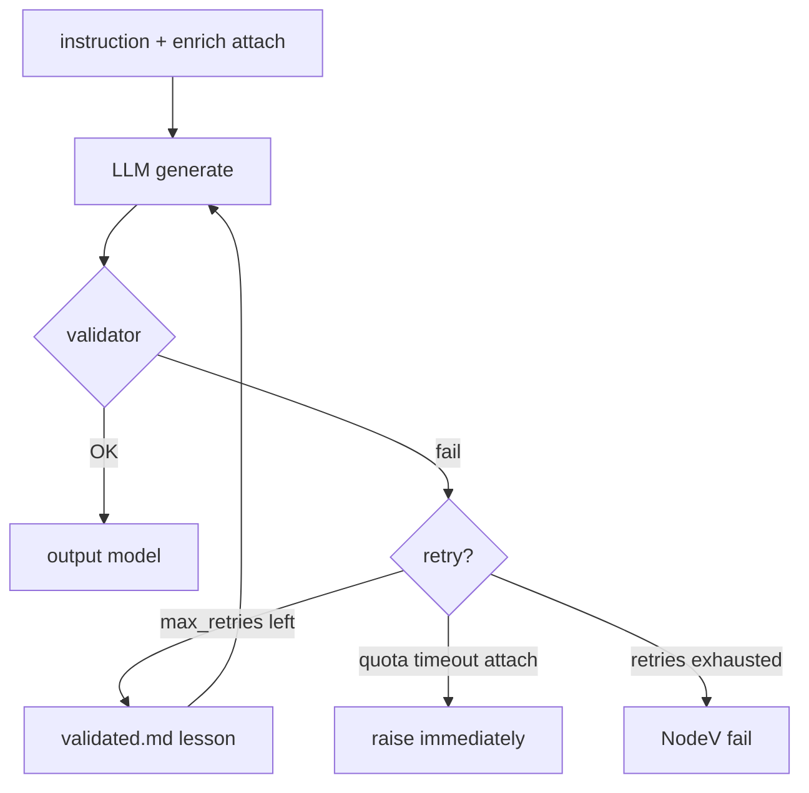
```mermaid
flowchart TD
    A["instruction + enrich attach"] --> B[LLM generate]
    B --> C{validator}
    C -->|OK| D[output model]
    C -->|fail| E{retry?}
    E -->|max_retries left| F[validated.md lesson]
    F --> B
    E -->|quota timeout attach| G[raise immediately]
    E -->|retries exhausted| H[NodeV fail]
```

- `@node(input=..., output=...)` — `sage/nodes/framework.py`
- `NodeFactory` — `cfg.nodes_path`(기본 `nodes/`)에서 노드 로드
- **즉시 raise** (재시도 없음): `QuotaExceededError`, `LLMTimeoutError`, `ContextAttachTooLargeError`

Node 작성법: [nodes.md](nodes.md)

### LLM 백엔드 (`SAGE_LLM_TYPE`)

| 파일 | 역할 |
|------|------|
| `llms.py` | `LLMFactory`, Gemini/GPT/Claude/Cursor 구현 |
| `usage.py` | ContextVar 토큰·비용 집계 (report generation별) |
| `pricing.py` | 모델별 $/1M tokens |
| `prompt_telemetry.py` | `[prompt]` 로그 (attach bytes 포함) |
| `gemini_schema.py` | Gemini structured output JSON schema |

| env 값 | 구현 |
|--------|------|
| `gemini` (기본) | `GeminiLLM` |
| `gpt-5` | `GPT5LLM` |
| `claude` | `ClaudeLLM` |
| `cursor` | `CursorLLM` (`SAGE_CURSOR_RUNTIME=local\|cloud`) |

- attach 상한: `SAGE_LLM_ATTACH_MAX_BYTES` (256KB), release 512KB
- usage: `sage/llm/usage.py` — report generation별 ContextVar 집계

### Prompt enrich (`sage/prompt/enrich.py`)

| 파일 | 역할 |
|------|------|
| `enrich.py` | `EnrichRule` — trigger 필드 → target 필드 enrich |
| `report_prompts.py` | runtime contract, domain brief (category 기반) |
| `dataset.py` | `data_id` → dataset_context, schema attach |
| `core.py` | 프롬프트 조각 로드 (`nodes/.prompts/` 경로 해석) |

| trigger | target | 예 |
|---------|--------|-----|
| `tools` | tools spec JSON | MCP `list_tools` attach |
| `data_id` | `dataset_context` | schema·metadata |
| `plan_id` | board / upstream | TaskContext attach |

`should_inject_domain_brief` — category/keyword 기반 domain brief (stock 전역 주입 금지).

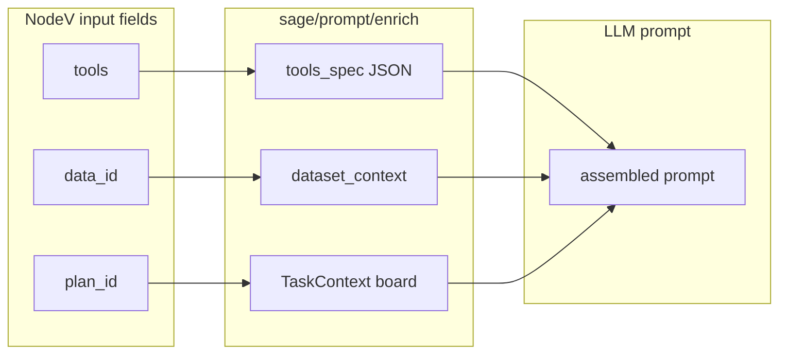
```mermaid
flowchart LR
    subgraph Input["NodeV input fields"]
        T[tools]
        D[data_id]
        P[plan_id]
    end

    subgraph Enrich["sage/prompt/enrich"]
        TS[tools_spec JSON]
        DC[dataset_context]
        BD[TaskContext board]
    end

    subgraph Attach["LLM prompt"]
        PR[assembled prompt]
    end

    T --> TS --> PR
    D --> DC --> PR
    P --> BD --> PR
```

**attach 크기 제한**

- codegen: `SAGE_LLM_ATTACH_MAX_BYTES` (기본 256KB)
- release: 512KB
- 초과 시 `ContextAttachTooLargeError` — **재시도 없이 즉시 실패**

---

## Exec 격리 (docker_pool)

**`SAGE_EXEC_DRIVER=docker_pool`만 지원** — in-process exec fallback 없음.

### exec 표면

| kind | entry | 빌더 | 호출처 |
|------|-------|------|--------|
| `report_task` | `srcs/task-*.py:run_task` | `build_report_task_job` | `sage/report/runner.py` |
| `pangea_unify` | `unify.py:unify_data` | `build_pangea_unify_job` | `routers/data.py` |
| `tool_caller` | `caller.py:main` | `build_tool_caller_job` | `sage/tool/runtime.py` |

### Worker 환경 (`ExecJob.env`)

```text
NARRATIX_HOME=/host/n2
PYTHONPATH=/host/n2
SAGE_MCP_BASE_URL=http://host.docker.internal:8091
```

- bind mount: `${NARRATIX_HOME}:/host/n2:rw`
- worker → host MCP: `host.docker.internal:8091` (stdio MCP subprocess에도 env 전파)

### exec job 흐름 (docker_pool)

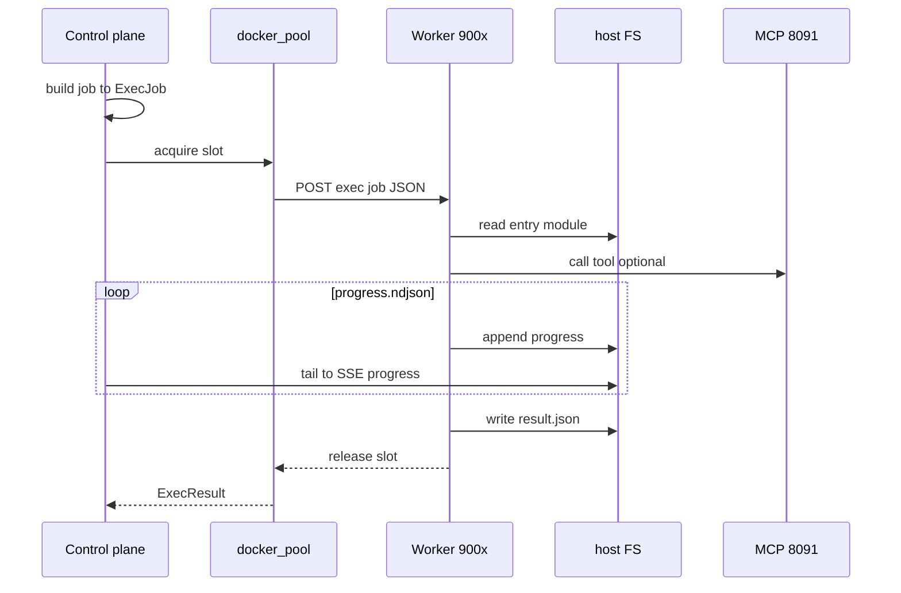
```mermaid
sequenceDiagram
    participant CP as Control plane
    participant Pool as docker_pool
    participant W as Worker 900x
    participant FS as host FS
    participant MCP as MCP 8091

    CP->>CP: build job to ExecJob
    CP->>Pool: acquire slot
    Pool->>W: POST exec job JSON
    W->>FS: read entry module
    W->>MCP: call tool optional
    loop progress.ndjson
        W->>FS: append progress
        CP->>FS: tail to SSE progress
    end
    W->>FS: write result.json
    W-->>Pool: release slot
    Pool-->>CP: ExecResult
```

### 기동

```bash
docker compose up -d                              # n2-db
docker compose -f docker-compose.exec.yml up -d --build   # n2-exec
python main.py                                    # API + MCP + pool restart
```

---

## MCP · Tool

### 이중 프로세스

| | Control (8090) | Gateway (8091) |
|--|----------------|----------------|
| 역할 | codegen, DB, SSE | assetized 도구 HTTP mount |
| Client | `sage/mcp/call` (host) | worker도 동일 URL |

### 전송 경로 (`get_transport_path`)

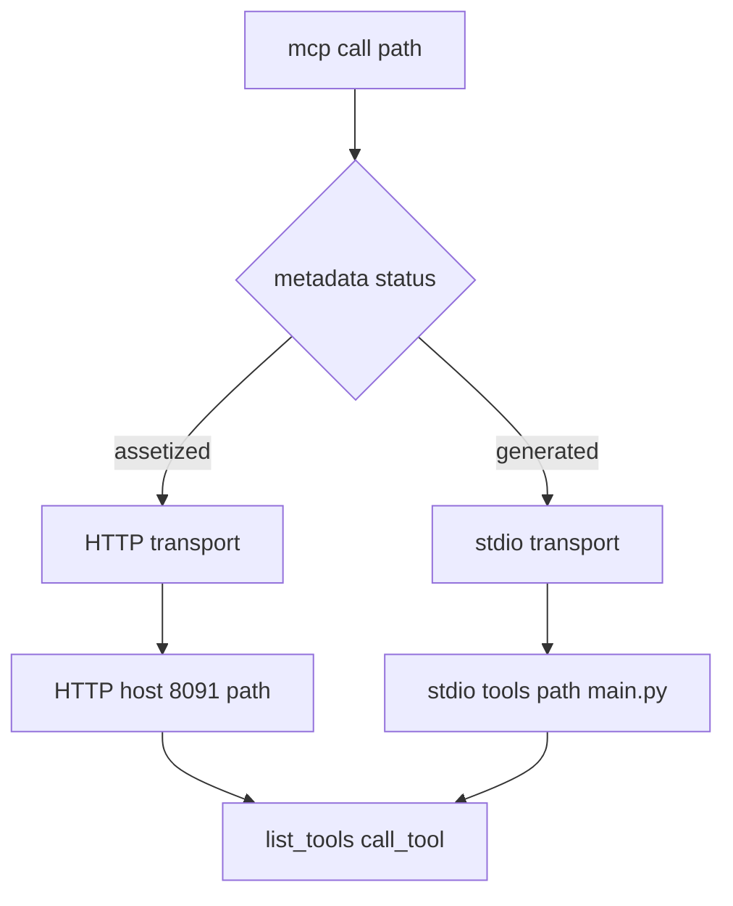
```mermaid
flowchart TD
    A["mcp call path"] --> B{metadata status}
    B -->|assetized| C[HTTP transport]
    B -->|generated| D[stdio transport]
    C --> E["HTTP host 8091 path"]
    D --> F["stdio tools path main.py"]
    E --> G[list_tools call_tool]
    F --> G
```

```
metadata.status == assetized  →  http://host:8091/{path}/
그 외 (generated)             →  stdio subprocess tools/{path}/main.py
```

### 도구 생명주기

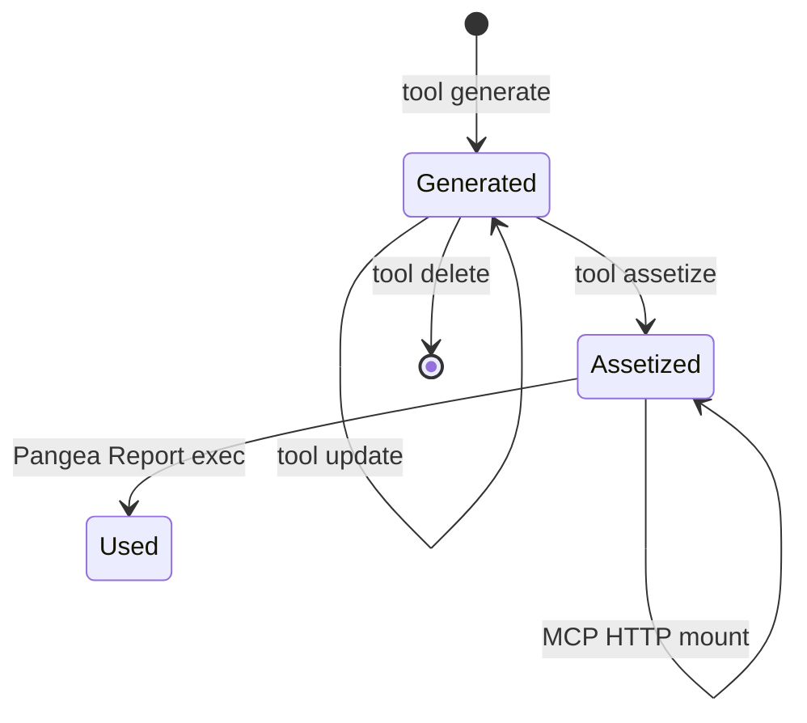
```mermaid
stateDiagram-v2
    [*] --> Generated: tool generate
    Generated --> Generated: tool update
    Generated --> Assetized: tool assetize
    Assetized --> Assetized: MCP HTTP mount
    Assetized --> Used: Pangea Report exec
    Generated --> [*]: tool delete
```

```
POST /tool/generate  →  tools/tm-{name}-{uuid8}/  (status=generated)
POST /tool/assetize  →  tools/kis/stock/          (status=assetized, MCP mount)
Pangea / Report      →  path 로 참조 (예: "kis/stock")
```

- `normalize_mcp_tool_path`: LLM이 `kis/stock/get_stock_prices`처럼 tool명까지 붙인 path → `kis/stock` 축소

자세한 내용: [tools.md](tools.md)

---

## SSE 프로토콜

generate/update API는 **Server-Sent Events**로 진행 상태를 스트리밍합니다.

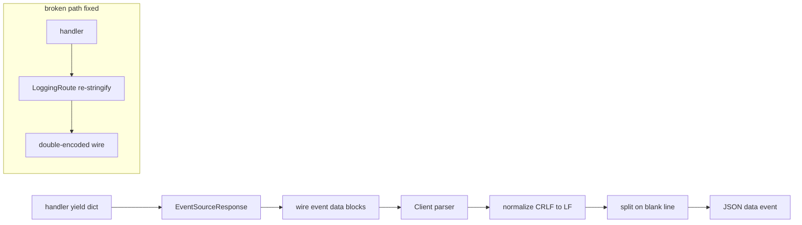
```mermaid
flowchart LR
    H[handler yield dict] --> ESR[EventSourceResponse]
    ESR --> W[wire event data blocks]
    W --> C[Client parser]
    C --> N[normalize CRLF to LF]
    N --> P[split on blank line]
    P --> J[JSON data event]

    subgraph broken["broken path fixed"]
        H2[handler] --> LR[LoggingRoute re-stringify]
        LR --> X[double-encoded wire]
    end
```

### 인코딩 (`routers/base.py`)

```python
SSEEncoder.encode("completed", "메시지", rid=..., result=...)
# → {"event": "completed", "data": '{"event":"completed","msg":"...", ...}'}
```

- `EventSourceResponse`가 `\r\n` wire format으로 변환
- `LoggingRoute`(`sage/logg.py`)는 **dict를 그대로 yield** (로그만 기록). 문자열로 재조립하면 wire가 깨집니다.

### 클라이언트 파싱

- 메시지 구분: `\n\n` (wire는 `\r\n\r\n` → 수신 후 `\r\n`→`\n` 정규화 권장)
- `event:` 라인 + `data:` JSON
- `data` JSON 내부 `"event"` 필드 fallback

테스트 스크립트: `_scripts/test_report_generate.py`, `_scripts/loop_generate_30m.py`, `_scripts/test_sse_wire.py`

---

## 환경 변수 (전체)

[`.env.example`](../.env.example) 기준.

### LLM

| 변수 | 기본 | 설명 |
|------|------|------|
| `NARRATIX_HOME` | 프로젝트 루트 | `cfg.root_path`, worker mount |
| `SAGE_LLM_TYPE` | `gemini` | LLM 백엔드 |
| `GEMINI_API_KEY` / `GPT_API_KEY` / `CLAUDE_API_KEY` / `CURSOR_API_KEY` | — | LLM별 키 |
| `SAGE_LLM_TIMEOUT_SEC` | `120` | generate 타임아웃 (release attach 시 600 권장) |
| `SAGE_CURSOR_RUNTIME` | `local` | Cursor local vs cloud |
| `SAGE_CURSOR_MODEL` | `composer-2.5` | Cursor 모델 |
| `SAGE_LLM_ATTACH_MAX_BYTES` | `262144` | attach 상한 |
| `SAGE_LLM_ATTACH_RELEASE_MAX_BYTES` | `524288` | release attach 상한 |
| `LOG_LEVEL` | — | 로깅 |

### Exec · MCP

| 변수 | 기본 | 설명 |
|------|------|------|
| `SAGE_EXEC_DRIVER` | `docker_pool` | **유일 지원 driver** |
| `SAGE_EXEC_TIMEOUT_SEC` | `600` | job timeout |
| `SAGE_EXEC_STALL_SEC` | `45` | progress 없으면 stall fail-fast |
| `SAGE_EXEC_POOL_ACQUIRE_SEC` | `120` | slot 대기 |
| `SAGE_EXEC_MAX_JOBS_PER_CONTAINER` | `50` | worker recycle 기준 |
| `SAGE_EXEC_DOCKER_IMAGE` | `sage-exec:latest` | worker 이미지 |
| `SAGE_MCP_BASE_URL` | `http://host.docker.internal:8091` | worker → host MCP |
| `SAGE_MCP_BIND_HOST` | docker_pool 시 `0.0.0.0` | MCP gateway bind |

### 보안 · DB

| 변수 | 기본 | 설명 |
|------|------|------|
| `SAGE_API_KEY` | (비어 있음) | REST 인증 — 비어 있으면 비활성 |
| `MONGODB_URI` | `mongodb://localhost:27017` | FerretDB |
| `SAGE_DB_NAME` | `sage_db` | DB 이름 |
| `SAGE_NODES_PATH` | `./nodes` | 외부 nodes 트리 |
| `KIWOOM_ACCESS_TOKEN` | — | `sage/data/kiwoom.py` |

### cfg.py 하드코드

- API: `host='localhost'`, `port=8090`
- MCP: `port + 1` = **8091**

---

## 코드 탐색 순서 (신규 개발자)

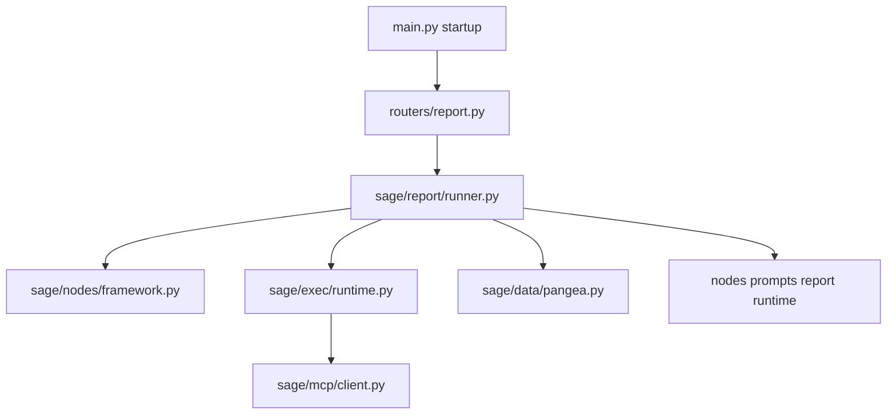
```mermaid
flowchart TD
    A[main.py startup] --> B["routers/report.py"]
    B --> C["sage/report/runner.py"]
    C --> D["sage/nodes/framework.py"]
    C --> E["sage/exec/runtime.py"]
    E --> F["sage/mcp/client.py"]
    C --> G["sage/data/pangea.py"]
    C --> H["nodes prompts report runtime"]
```

1. `main.py` → startup (MCP, exec pool)
2. `routers/report.py` — `handle_report_generation` SSE handler
3. `sage/report/runner.py` — `iter_plan_tasks`, `codegen_task`, `run_task_code`
4. `sage/nodes/framework.py` — NodeV 루프
5. `sage/exec/runtime.py` + `jobs.py` + `worker_core.py`
6. `sage/mcp/client.py` — `call`, `create_app`
7. `sage/data/pangea.py` — unify orchestration
8. `nodes/.prompts/report/runtime/` — task별 runtime contract

---

## 플랫폼 설계 원칙

버그·품질 이슈 대응 시 우선순위:

1. **플랫폼·가이드 수정** — exec env, SSE wire, MCP path, prompt contract
2. **LLM-natural API** — validator가 막기 전에 instruction/runtime으로 유도
3. **validator band-aid 최소화** — codegen 실패를 숨기는 one-off 규칙 지양

| 레이어 | 질문 | 구현 |
|--------|------|------|
| API 인증 | *누가* 요청하는가? | `SAGE_API_KEY` |
| Exec 격리 | 생성 코드가 *어디까지* 가능한가? | `docker_pool`, worker env 최소화 |
| MCP | worker가 host 도구에 *어떻게* 접근? | `SAGE_MCP_BASE_URL`, bind `0.0.0.0` |
| Context attach | LLM 입력이 *얼마나* 커지는가? | rid filter, release dedupe, attach byte cap |

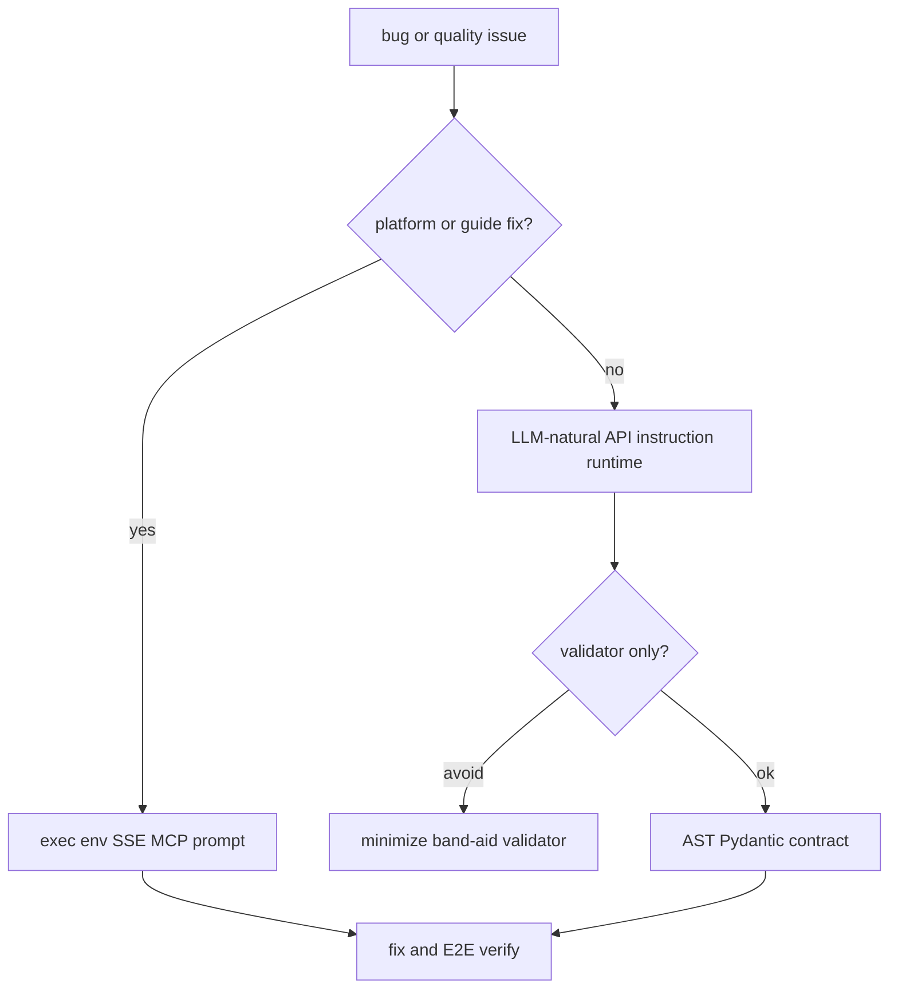
```mermaid
flowchart TD
    Issue[bug or quality issue] --> Q{platform or guide fix?}
    Q -->|yes| P[exec env SSE MCP prompt]
    Q -->|no| L[LLM-natural API instruction runtime]
    L --> V{validator only?}
    V -->|avoid| B[minimize band-aid validator]
    V -->|ok| R[AST Pydantic contract]
    P --> Done[fix and E2E verify]
    R --> Done
```

---

## 트러블슈팅

### 증상별 체크리스트

| 증상 | 확인 | 수정 위치 |
|------|------|-----------|
| SSE 클라이언트가 `completed` 못 받음, `stream ended ()` | `LoggingRoute`가 dict pass-through인지; 파서 `\r\n\r\n`→`\n\n` | `sage/logg.py`, 클라이언트 파서 |
| Docker worker MCP `ConnectError localhost:8091` | worker `SAGE_MCP_BASE_URL`; MCP bind `0.0.0.0`; stdio subprocess env | `cfg.py`, `sage/mcp/client._stdio_subprocess_env` |
| `load_tools_spec 실패 [kis/stock/get_stock_prices]` | LLM이 function명까지 path에 포함 | `sage/report/plan_tools.normalize_mcp_tool_path` |
| exec pool acquire timeout | `docker compose -f docker-compose.exec.yml ps`; `:9001/health` | worker 재기동, `SAGE_EXEC_POOL_ACQUIRE_SEC` |
| release·plan codegen token 폭주 (~500K+) | stale `context.json` rid mismatch; release attach 중복 | `sage/report/context.py`, `sage/prompt/enrich.py` |
| codegen `validated.md` 무한 반복 | instruction ↔ runtime contract 불일치 | `nodes/.../validated.md`, `nodes/.prompts/report/runtime/` |
| tool generate MCP smoke 실패 | assetize 전 stdio vs assetize 후 HTTP 혼동 | `get_transport_path`, assetize 상태 |
| WinError 10054/10061 (루프 테스트) | API 재시작·동시 generate 과부하 | 순차 실행, `main.py` 재기동 후 테스트 |

### SSE 디버깅

```bash
# wire 확인 (한 이벤트 블록)
curl -N -X POST http://127.0.0.1:8090/report/generate \
  -H "Content-Type: application/json" \
  -d '{"did":"did-...","query":"..."}' 2>&1 | head -50

python _scripts/test_sse_wire.py
```

올바른 wire: `event: planning\r\ndata: {"event":"planning",...}\r\n\r\n`

### exec worker 디버깅

```bash
docker compose -f docker-compose.exec.yml ps
curl http://127.0.0.1:9001/health
docker exec -it n2-exec-sage-exec-1 curl -s http://host.docker.internal:8091/kis/stock/
```

### 알려진 함정 (수정 이력)

| 이슈 | 원인 | 수정 |
|------|------|------|
| 루프 테스트 100% FAIL | `LoggingRoute`가 SSE dict를 문자열로 재인코딩 → wire 깨짐 | dict 그대로 yield |
| 서버 `completed`인데 클라이언트 미수신 | EventSourceResponse 이중 인코딩 + 파서 `\n\n` 미처리 | `base.py` `event` in JSON, 파서 정규화 |
| MCP from Docker `localhost` | stdio MCP subprocess에 `SAGE_MCP_BASE_URL` 미전파 | `os.environ.copy()` + bind host |
| domain brief 전역 주입 | stock 키워드 on any description | `should_inject_domain_brief` category 기반 |
| completed SSE payload 과대 | dataset 전체 `data` 포함 | `_client_report_payload` 슬림화 |

---

## 서버 실행·디버깅

```bash
# 1. DB (postgres + ferretdb + mongo-express)
docker compose up -d

# 2. Exec warm pool (report/unify/tool 격리)
docker compose -f docker-compose.exec.yml up -d --build

# 3. API (+ MCP :8091 자식 프로세스, exec pool restart)
python main.py              # 기본 localhost:8090
python main.py --reload     # reports/data/dump 변경 제외 auto-reload
```

| URL | 용도 |
|-----|------|
| http://127.0.0.1:8090/docs | OpenAPI — Try it out 로 요청 테스트 |
| http://127.0.0.1:8090/ | API 헬스 |
| http://127.0.0.1:8091/ | MCP 게이트웨이 (assetize된 도구) |

SSE API(`/data/pangeaze`, `/report/generate` 등)는 **Postman** 또는 `curl -N`으로 단계별 이벤트를 확인하는 것이 편합니다.

환경 변수는 [`.env.example`](../.env.example) 참고. codegen 대용량 attach 시 `SAGE_LLM_TIMEOUT_SEC=600` 권장.

### API 인증

`.env`에 `SAGE_API_KEY`를 설정하면 REST API가 shared secret으로 보호됩니다. **비어 있으면 인증 비활성** (로컬 개발 기본).

| 방식 | 예 |
|------|-----|
| 헤더 (권장) | `API-Key: <SAGE_API_KEY>` |
| Bearer (`/admin/*` 제외) | `Authorization: Bearer <SAGE_API_KEY>` |
| 쿼리 (SSE·EventSource) | `?api_key=<SAGE_API_KEY>` |

면제: `GET /` 헬스, `GET /docs`·`/openapi.json`(Swagger UI), **`/admin/*`**(JWT). `/admin/*`의 `Authorization: Bearer`는 admin JWT 전용.

**프론트엔드(layout-admin UI):**
- `/admin/*` 호출: 로그인 후 쿠키(`sage_admin_token`) 또는 Bearer JWT — API Key 불필요
- `/data`, `/report`, `/tool` 등 SAGE API 호출: 모든 요청에 `API-Key: <SAGE_API_KEY>` 헤더 추가 (axios/fetch interceptor 권장)
- SSE(EventSource): URL에 `?api_key=<SAGE_API_KEY>` 쿼리 추가 (헤더 불가)

```bash
curl -H "API-Key: $SAGE_API_KEY" -X POST http://127.0.0.1:8090/data/list/query -H "Content-Type: application/json" -d "{}"
curl -N -H "API-Key: $SAGE_API_KEY" -X POST http://127.0.0.1:8090/data/pangeaze ...
```

> MCP 게이트웨이 `:8091`은 아직 별도 — Phase 2에서 동일 키 적용 예정.

---

## API 요약

### `/data`

| Method | Path | 설명 |
|--------|------|------|
| POST | `/upload` | 파일 업로드 → `uploads/{uuid}/filename` 경로·컬럼 메타 반환 |
| POST | `/pangeaze` | **All-in-one** 등록: 소스 배치 → schema/adapter/unify codegen → 실행 (SSE) |
| POST | `/pangeaze/update` | 확정 스키마로 unify 재생성·실행 (SSE). create 와 동일: `unify_data(did, reporter)` + multi-target parquet, 버전 `v{n+1}` |
| GET | `/view?did=&limit=&model=` | 통합 parquet 샘pling |
| POST | `/list/query` | 데이터셋 목록 (status, category 필터) |
| POST | `/info` | 단일 데이터셋 문서 |
| DELETE | `/delete` | 데이터셋 삭제 |

> **구 API 제거:** `/data/register`, `/data/pangea/analyze`, `/data/pangea/unify`, GET `/data/list` — 모두 **`POST /pangeaze`** 로 통합.

#### Pangea 등록 예 (`POST /data/pangeaze`)

```json
{
  "name": "상장사 재무 분석 통합",
  "query": "주식 목록과 KIS API PER/PBR을 srtnCd 기준으로 통합",
  "category": "finance",
  "sources": [
    {
      "type": "file",
      "path": "a1b2c3d4/stocks.csv",
      "format": "csv",
      "options": { "encoding": "utf-8" },
      "sheets": [{
        "name": "Sheet1",
        "columns": [
          { "name": "srtnCd", "type": "str", "selected": true },
          { "name": "clpr", "type": "float", "selected": true }
        ]
      }]
    },
    { "type": "tool", "path": "kis/stock" }
  ]
}
```

`path`는 **`POST /upload` 반환값**을 사용합니다. 도구는 **assetize된 경로**(`kis/stock` 등)만 유효합니다.

#### Pangea SSE 이벤트

`initializing` → `generating` → `executing` → `progress` → `completed` | `error`

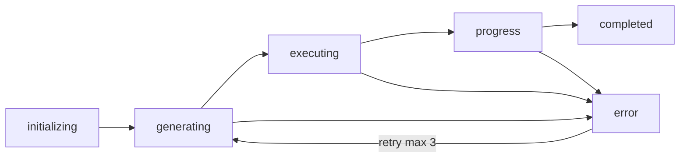
```mermaid
flowchart LR
    I[initializing] --> G[generating]
    G --> E[executing]
    E --> P[progress]
    P --> C[completed]
    G --> ERR[error]
    E --> ERR
    P --> ERR
    ERR -->|retry max 3| G
```

실패 시 unify 로직 전체 재생성을 최대 3회 재시도합니다.

#### Pangea codegen·exec 파이프라인

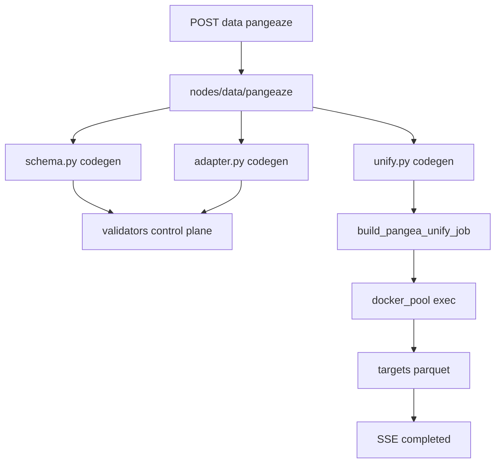
```mermaid
flowchart TD
    A[POST data pangeaze] --> B["nodes/data/pangeaze"]
    B --> C[schema.py codegen]
    B --> D[adapter.py codegen]
    B --> E[unify.py codegen]
    C --> F[validators control plane]
    D --> F
    E --> G[build_pangea_unify_job]
    G --> H[docker_pool exec]
    H --> I[targets parquet]
    I --> J[SSE completed]
```

#### 데이터셋 디렉터리

```
data/{did}/
├── raw/                          # 업로드 원본
└── pangea/v1/
    ├── metadata.json             # sources, targets, field TTL
    ├── schema.py                 # PangeaSchema (Pydantic)
    ├── adapter.py                # MCP 응답 → 표준 필드
    ├── unify.py                  # unify_data() — 통합 로직
    └── targets/
        └── PangeaSchema/         # model별 parquet
```

- **Forward (배치):** `unify.py`가 모든 소스를 읽어 parquet 생성
- **Backward (지연):** `metadata.json` + `adapter.py` + TTL — report `data` 태스크 실행 시 MCP lazy 갱신

#### Pangea 내부 (`sage/data/pangea.py`)

| 단계 | 산출 | exec |
|------|------|------|
| schema codegen | `schema.py` (Pydantic) | control plane |
| adapter codegen | `adapter.py` (MCP→필드) | control plane |
| unify codegen | `unify.py` (`unify_data`) | **docker_pool** |
| 실행 | `targets/{Model}/*.parquet` | worker |

- `schema_contract.py` / `schema_types.py` — codegen validator·타입 캐스팅
- `dump_store.py` — MCP field dump JSON (TTL backward 갱신)
- `metadata_tool_paths` — dataset metadata의 `type=tool` sources → report plan tools 자동 merge

---

### `/report`

| Method | Path | 설명 |
|--------|------|------|
| POST | `/generate` | Plan → codegen → 실행 → report.json (SSE) |
| PATCH | `/update` | 지정 task + downstream 재생성·실행 (SSE) |
| POST | `/publish` | `completed` → `published` (exec 허용) |
| POST | `/exec` | published 보고서 재실행 — `runs/` 에 기록 (SSE) |
| POST | `/list/query` | 보고서 목록 (status 필터) |
| DELETE | `/delete` | mode: `all` \| `list` \| `exclude` |
| POST | `/assetize` | **deprecated** — 보고서는 `reports/{rid}/srcs/*.py` 로 관리 |

#### 보고서 생성 예 (`POST /report/generate`)

```json
{
  "did": "did-fx-report-1bab8d81",
  "query": "주요 통화 환율 추이와 변동성 분석 보고서",
  "description": "경영진 브리핑용",
  "tools": ["yf/fx-rate"]
}
```

#### 생성 파이프라인 (내부)

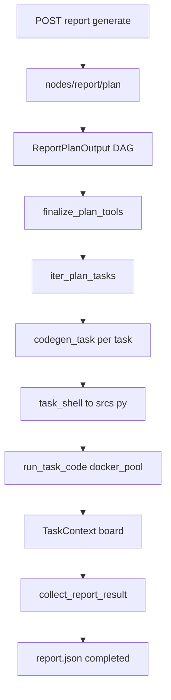
```mermaid
flowchart TD
    A[POST report generate] --> B["nodes/report/plan"]
    B --> C[ReportPlanOutput DAG]
    C --> D[finalize_plan_tools]
    D --> E[iter_plan_tasks]
    E --> F[codegen_task per task]
    F --> G["task_shell to srcs py"]
    G --> H[run_task_code docker_pool]
    H --> I[TaskContext board]
    I --> J[collect_report_result]
    J --> K[report.json completed]
```

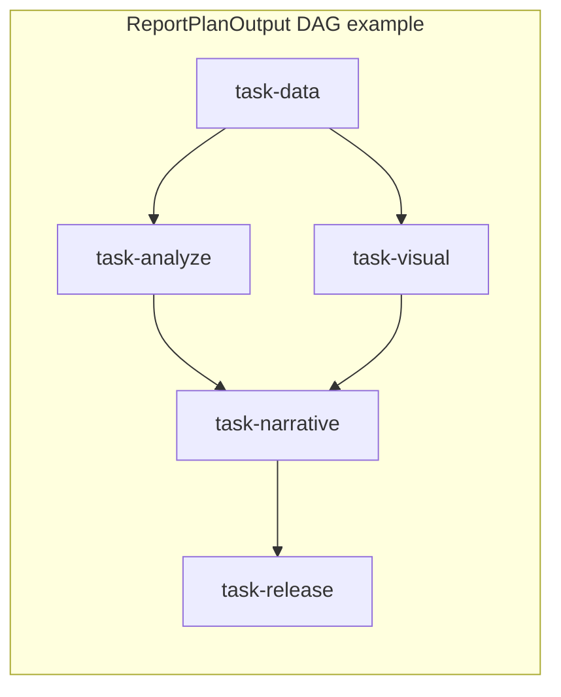
```mermaid
flowchart LR
    subgraph Plan["ReportPlanOutput DAG example"]
        TD[task-data] --> TA[task-analyze]
        TD --> TV[task-visual]
        TA --> TN[task-narrative]
        TV --> TN
        TN --> TR[task-release]
    end
```

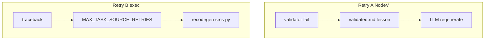
```mermaid
flowchart TB
    subgraph RetryA["Retry A NodeV"]
        V1[validator fail] --> L[validated.md lesson]
        L --> V2[LLM regenerate]
    end

    subgraph RetryB["Retry B exec"]
        X1[traceback] --> X2[MAX_TASK_SOURCE_RETRIES]
        X2 --> X3[recodegen srcs py]
    end
```

1. **plan** — `nodes/report/plan` → `ReportPlanOutput`
   - tasks[]: `data` | `analyze` | `visual` | `narrative` | `release`
   - `context[]`: upstream task_id (DAG edge)
   - `PlanStructureValidator` + `finalize_plan_tools()`

2. **codegen** — `sage/report/runner.py` → `codegen_task`
   - 타입별 NodeV: `nodes/report/task/{type}/`
   - `configure_task_validators` → MCP allow-list, upstream board, schema
   - LLM 출력 → `task_shell` → `reports/{rid}/srcs/{task_id}.py`
   - **재시도 A:** NodeV `max_retries` (validator/Pydantic)
   - **재시도 B:** `MAX_TASK_SOURCE_RETRIES=3` (exec traceback → 재codegen)

3. **exec** — `run_task_code` → `sage/exec/runtime.run_exec_job`
   - worker: `async def run_task(task, ctx, reporter=None)`
   - 결과: `ctx.update_task(key=..., value=...)` — JSON만 (DataFrame 직접 저장 금지)

4. **release / 수집**
   - `release` 태스크: `finalize_report_document`, `apply_upstream_patches`
   - `collect_report_result()` → `report.json`, `draft.json`
   - status: `planned` → `completed` → (`publish`) → `published`

#### TaskContext

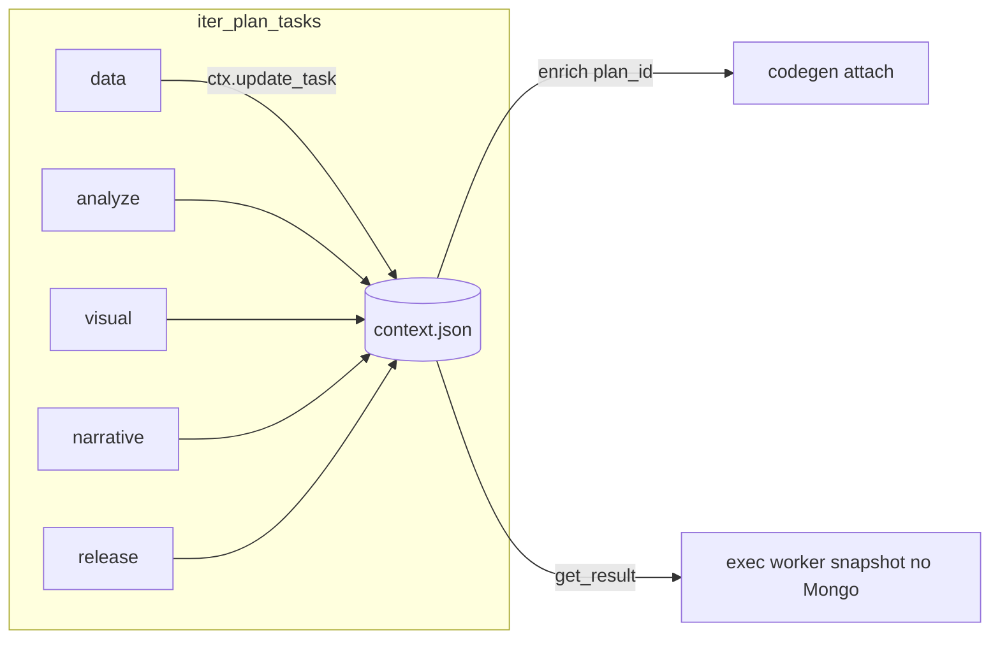
```mermaid
flowchart LR
    subgraph Tasks["iter_plan_tasks"]
        T1[data] -->|ctx.update_task| B[("context.json")]
        T2[analyze] --> B
        T3[visual] --> B
        T4[narrative] --> B
        T5[release] --> B
    end

    B -->|enrich plan_id| CG[codegen attach]
    B -->|get_result| EX["exec worker snapshot no Mongo"]
```

- persist: `dump/{plan_hex}/context.json`
- exec worker: Mongo 금지 — `ctx_snapshot` 또는 `ctx_path`만
- downstream: `get_result(upstream_tid, key)` — validator가 board와 교차검증
- rid mismatch 시 board 비우기 (stale attach 방지)

#### Plan · Task MCP tools

- `plan.tools`: catalog (API `tools[]` + metadata sources)
- `task.tools`: plan.catalog 부분집합 (data 타입은 plan 상속)
- `resolve_task_tool_paths`, `normalize_mcp_tool_path` — `sage/report/plan_tools.py`

#### codegen 계약

| 타입 | contract | validator |
|------|----------|-----------|
| data/analyze/visual | `codegen_contract.py` | `DataTaskFlowValidator`, `McpCallValidator`, … |
| release | `release_contract.py` | `ReleaseTaskValidator` — `apply_upstream_patches` 필수 |

Runtime enrich: `nodes/.prompts/report/runtime/{type}.md`

#### Report SSE 이벤트 (generate)

```mermaid
flowchart LR
    I[initializing] --> PL[planning]
    PL --> PD[planned]
    PD --> GN[generating]
    GN --> EX[executing]
    EX --> PR[progress]
    PR --> ED[executed]
    ED --> CP[completed]
    PL --> FL[failed]
    GN --> FL
    EX --> FL
```

`initializing` → `planning` → `planned` → `generating` → `executing` → `progress` → `executed` → `completed` | `failed`

- `planned`: `result`에 전체 plan JSON ([planned.json](planned.json) 참고)
- `executed`: 태스크별 codegen 결과·context board ([tasked.json](tasked.json) 참고)

#### exec 흐름

```mermaid
stateDiagram-v2
    [*] --> completed: report generate
    completed --> published: report publish
    published --> published: report exec rerun
```

1. `POST /report/generate` → status `completed`
2. `POST /report/publish` → status `published`
3. `POST /report/exec` → `runs/run-YYYYMMDD-HHMM/` 에 로그·결과 저장

`exec`는 codegen 없이 저장된 `srcs/{task_id}.py`만 실행합니다.

#### 보고서 수정 예 (`PATCH /report/update`)

```json
{
  "rid": "rp-a1b2c3d4",
  "query": "초보자도 이해할 수 있도록 서술을 단순화",
  "task_ids": ["task-volatility-analysis-2c3d4e5f"],
  "tools": []
}
```

`task_ids`의 **downstream 태스크**도 DAG closure로 함께 재생성됩니다.

#### 보고서 산출물

```
reports/{rid}/
├── plan.json
├── report.json          # release layout 문서
├── draft.json           # narrative 초안 (있을 경우)
├── context.json         # TaskContext 스냅샷
└── srcs/
    └── task-*.py        # codegen된 run_task 소스
```

---

### `/tool`

| Method | Path | 설명 |
|--------|------|------|
| POST | `/generate` | LLM codegen + smoke test (SSE) |
| PATCH | `/update` | 도구 수정 (SSE) |
| POST | `/exec` | 자연어 → executor 노드 → caller 실행 |
| POST | `/assetize` | `tm-*` → namespace 경로, MCP HTTP 노출 |
| POST | `/list/query` | status/category/tags 필터 |
| POST | `/recommend` | did 기반 도구 추천 |
| GET | `/info/{tool_id}` | 도구 상세 |
| DELETE | `/delete` | 도구 삭제 |

#### 도구 실행 예 (`POST /tool/exec`)

```json
{
  "query": "미국 달러 환율 최근 3개월 시계열",
  "tools": ["yf/fx-rate"]
}
```

#### 도구 생성 → assetize

```mermaid
flowchart TD
    G[tool generate SSE] --> N["nodes/tool/generator"]
    N --> M["main.py and caller.py"]
    M --> S[smoke test docker_pool]
    S --> A[tool assetize]
    A --> H[MCP HTTP mount port 8091]
    H --> U["Pangea Report exec"]
```

1. `POST /tool/generate` → `tm-{name}-{uuid8}` 생성
2. 검증 통과 후 `POST /tool/assetize` → `asset_path` (예: `kis/stock`) 로 승격
3. MCP 게이트웨이(8091)에서 HTTP로 mount — Pangea·report에서 `path`로 참조

자세한 내용: [tools.md](tools.md)

---

### `/secret`

| Method | Path | 설명 |
|--------|------|------|
| POST | `/register` | provider별 API 키 암호화 저장 (`sk-*`) |
| POST | `/list` | 등록 키 목록 (값 미포함) |
| DELETE | `/delete` | secret 삭제 |

도구 codegen 시 `secret_id`를 전달하면 등록된 키를 attach합니다.

---

### `/admin/*` (layout-admin UI)

| Prefix | 설명 |
|--------|------|
| `/admin/auth` | 로그인·로그아웃·세션·비밀번호 변경 |
| `/admin/user` | 관리자 계정 CRUD |
| `/admin/org` | API 연동 조직·키 관리 |
| `/admin/code` | 공통 코드(그룹/상세) 관리 |

초기 계정 시드: `python scripts/seed_admin.py` (MongoDB 연결 필요).

---

## 샘플 데이터

| 파일 | 용도 |
|------|------|
| [resources/stocks.csv](../resources/stocks.csv) | 주식 시세 샘플 |
| [resources/emps.csv](../resources/emps.csv) | HR 샘플 |
| [resources/stocks100.csv](../resources/stocks100.csv) | 소규모 주식 목록 |

업로드 후 반환된 `path`를 pangeaze `sources[].path`에 넣습니다.

---

## 응답 샘플 (JSON)

| 파일 | 설명 |
|------|------|
| [planned.json](planned.json) | `/report/generate` — `planned` 이벤트 |
| [tasked.json](tasked.json) | `/report/generate` — `executed` 이벤트 |
| [data_list.json](data_list.json) | `/data/list/query` 응답 |

---

## 관련 문서

| 문서 | 내용 |
|------|------|
| [nodes.md](nodes.md) | NodeV, instruction.md, validated.md, `@node` 패턴 |
| [tools.md](tools.md) | MCP 도구 작성·namespace·assetize |
| [exec-isolation.md](exec-isolation.md) | ExecJob/ExecResult 계약, docker_pool, worker env, Phase 이력 |

### 테스트·스크립트

| 스크립트 | 용도 | 실행 예 |
|----------|------|---------|
| `_scripts/test_report_generate.py` | POST `/report/generate` E2E (SSE) | `python _scripts/test_report_generate.py` |
| `_scripts/test_tool_exec.py` | docker_pool + MCP smoke | `python _scripts/test_tool_exec.py` |
| `_scripts/loop_generate_30m.py` | report/tool 6케이스 순차 루프 | `python _scripts/loop_generate_30m.py` |
| `_scripts/test_sse_wire.py` | SSE wire + 파서 단위 검증 | `python _scripts/test_sse_wire.py` |

**E2E 전제 조건:** `docker compose up -d`, `docker compose -f docker-compose.exec.yml up -d`, `python main.py` 실행 중, `.env`에 LLM 키 설정.

**로그 확인:** `logs/sage.log` (전역), `logs/report/rp-*.log` (report별 prompt·SSE), `reports/{rid}/.exec/` (worker progress/result JSON).
