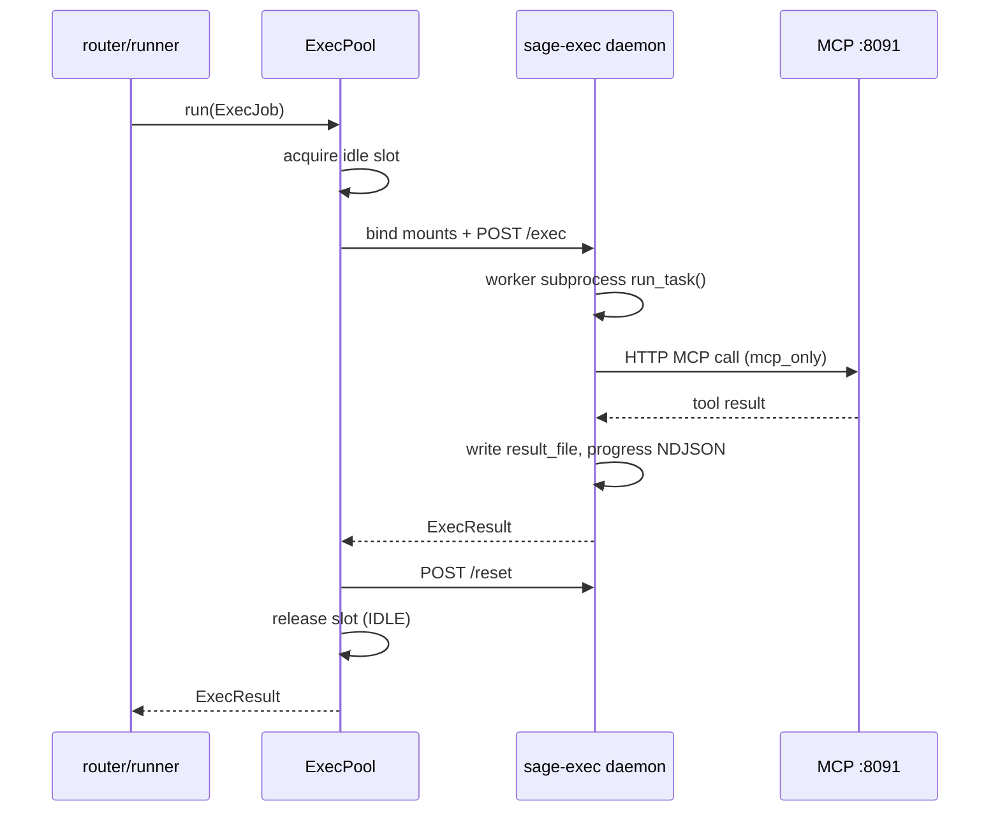

# Exec 격리 — 작업 명세

> **상태:** 명세 (미구현)  
> **브랜치:** `feature/exec-isolation` (또는 `feature/security-hardening` 하위)  
> **선행:** API 인증 (`SAGE_API_KEY`, `sage/auth/api_key.py`) — **완료**  
> **관련 리뷰:** [sage-code-review](../canvases/sage-code-review.canvas.tsx) — 보안·격리 **C**

---

## 1. 배경

SAGE는 LLM이 생성한 Python을 **품질 검증**(AST validator, smoke test, lesson loop)과 함께 **런타임에서 직접 실행**합니다.  
검증은 codegen 품질을 높이지만 **보안 경계는 아닙니다**. 생성 코드가 API 프로세스와 **동일 OS 사용자·동일 Python 인터preter**에서 `exec` / `importlib` 로 로드되면, 호스트 파일시스템·네트워크·DB·시크릿에 사실상 전권을 갖습니다.

### 1.1 API 인증과의 관계

| 레이어 | 질문 | 상태 |
|--------|------|------|
| **API 인증** | *누가* 실행을 요청하는가? | `SAGE_API_KEY` — 완료 |
| **Exec 격리** | 생성 코드가 *어디까지* 할 수 있는가? | **본 명세 — 다음 작업** |

두 레이어는 독립적입니다. 인증 없이도 exec 격리는 필요하고, 인증만으로는 악성·오류 codegen의 호스트 영향을 막을 수 없습니다.

---

## 2. 문제 — 현재 exec 표면

LLM 생성 코드를 **in-process** 로 실행하는 진입점:

| 표면 | 파일·함수 | 실행 방식 | 위험 |
|------|-----------|-----------|------|
| Report 태스크 | `sage/report/runner.py` → `run_task_code` | `sage/exec` docker_pool (fail-fast) | ✅ 격리됨 |
| Tool caller | `sage/tool/runtime.py` → `execute` / `execute_caller_with_fix` | `sage/exec` docker_pool (`tool_caller` job) | ✅ 격리됨 |
| Pangea unify | `routers/data.py` → `_run_unify_data` | `sage/exec` docker_pool (`pangea_unify` job) | ✅ 격리됨 |
| Pangea schema | `sage/data/pangea.py` (schema.py 로드) | `load_module` | codegen 산출물 — 중간 |
| MCP tool main | `sage/mcp/client.py` | `importlib` (assetize된 도구) | assetize 후에도 LLM origin |

**아티팩트 격리(이미 존재)** 와 **프로세스 격리(부재)** 를 구분합니다.

| 종류 | 예 | 상태 |
|------|-----|------|
| 디렉터리 격리 | `reports/{rid}/`, `runs/run-*`, `data/{did}/pangea/vN/` | ✅ 구현됨 |
| 모듈명 격리 | `p2_exec_{task_id}`, `caller_{tool_id}_{uuid}` | ✅ 부분적 |
| **OS/프로세스 격리** | worker subprocess / container | ✅ report + pangea unify (docker_pool) |

---

## 3. 목표

### 3.1 아키텍처

```text
Control plane (8090)              Data plane (exec worker)
────────────────────────          ─────────────────────────
main.py / routers                 LLM 생성 .py 실행만
NodeV / LLM codegen               좁은 FS · 제한 네트워크
DB (FerretDB) · SSE               timeout · kill · artifact 반환
시크릿 복호 · MCP 세션 관리
```

**원칙:** *생성은 안쪽, 실행은 바깥.*

- Control: codegen, validator, 메타 저장, SSE 브로드캐스트, 시크릿·DB 접근
- Worker: **이미 기록된 `.py` + 허용 workspace** 만 읽고 entry callable 실행
- Worker는 Mongo URL, LLM API key, Fernet key, `.env` 를 **받지 않음**

### 3.2 비목표 (Out of scope)

- RestrictedPython / AST 샌드박스만으로 “해결” 선언
- codegen 품질 validator 제거 또는 대체
- Kubernetes / 클라우드 오케스트레이션 (Phase C 이후 별도)
- MCP 게이트웨이(8091) 컨테이너 이전 — worker는 `host.docker.internal:8091` HTTP만 (§8.1)

---

## 4. 공통 계약 — `ExecJob` / `ExecResult`

신규 모듈: **`sage/exec/`** (가칭)

### 4.1 ExecJob

```python
@dataclass
class ExecJob:
    kind: Literal["report_task", "pangea_unify", "tool_caller"]
    job_id: str              # uuid — 로그·progress·pool 추적
    workspace: Path          # 호스트 절대경로 (bind mount 소스)
    entry_file: Path         # workspace 기준 상대 또는 절대
    entry_callable: str      # "run_task" | "unify_data" | "main"
    args: dict[str, Any]     # JSON-serializable — worker에 전달
    env: dict[str, str]      # allowlist만 (§6.3)
    limits: ExecLimits
    network: Literal["deny", "mcp_only"] = "deny"
    mounts: list[ExecMount] = field(default_factory=list)   # Docker §8
    progress_file: Path | None = None   # 호스트 경로 — NDJSON tail
    result_file: Path | None = None     # 호스트 경로 — ExecResult JSON
```

```python
@dataclass
class ExecMount:
    host_path: Path
    container_path: Path
    mode: Literal["ro", "rw"] = "rw"
```

```python
@dataclass
class ExecLimits:
    timeout_sec: int = 600
    mem_mb: int | None = 512      # Docker --memory
    cpu: float | None = None      # Docker --cpus (Phase C)
    pids_limit: int | None = 256  # Docker --pids-limit
```

### 4.2 ExecResult

```python
@dataclass
class ExecResult:
    ok: bool
    return_value: Any | None      # JSON-deserializable
    stdout_tail: str              # 마지막 N KB
    stderr_tail: str
    artifacts: list[str]          # workspace 내 상대 경로
    error: str | None
    duration_ms: int
    exit_code: int | None
```

### 4.3 단일 게이트

```python
# sage/exec/runtime.py
async def run(job: ExecJob, *, driver: str | None = None) -> ExecResult:
    ...
```

- `driver`: `subprocess` (Phase 0) → `docker` (Phase 3) → `docker_pool` (Phase 3+, 권장) → `queue` (Phase C)
- `cfg` / env: `SAGE_EXEC_DRIVER=subprocess|docker|docker_pool|inprocess`
- **`inprocess`**: 개발·회귀용 fallback — 기존 `exec` 경로 유지 (기본값은 Phase 0 완료 후 `subprocess`, Docker 목표는 `docker_pool`)

### 4.4 Worker 진입 스크립트

`python -m sage.exec.worker` — stdin 또는 `--job-file` 로 `ExecJob` JSON 수신:

1. `workspace` 로 `chdir` (또는 container bind)
2. `entry_file` 로드 → `entry_callable` 호출 (`args` 전달)
3. stdout/stderr 캡처, `ExecResult` JSON stdout 마지막 줄 또는 sidecar 파일 기록

Report `run_task(run, ctx, reporter)` 는 worker 내부에서 **얇은 shim** 이 `TaskRun` / `TaskContext` / `safe_report` 를 재구성해 호출합니다 (control과 동일 시그니처).

---

## 5. SAGE 표면별 매핑

### 5.1 `report_task`

| 항목 | 값 |
|------|-----|
| **트리거** | `runner.run_task_code`, `runner.run_task` |
| **workspace** | `{root}/reports/{rid}/` |
| **entry** | `srcs/{task_id}.py:run_task` |
| **args** | `run` (TaskRun dict), `ctx_snapshot_path` 또는 plan_id로 worker-side `TaskContext.load` |
| **network** | `mcp_only` (data 태스크 MCP 호출) |
| **산출** | `TaskContext` 갱신 → control이 `ctx.save()` 또는 worker가 context.json 직접 flush |

**치환:**

```text
run_task_code(source_path, run, ctx, reporter)
  → exec_runtime.run(ExecJob(kind="report_task", ...))
  → control: ExecResult 검증 후 ctx merge / save
```

**SSE progress:** worker가 `progress_file` 에 NDJSON append → control `TaskReporter`/`RunTaskReporter` 가 tail 폴링 (기존 drain 패턴 유지).

**병렬 DAG:** worker 프로세스는 태스크별 독립 — control의 `_iter_tasks_parallel` + `ctx_lock` 유지.

### 5.2 `pangea_unify`

| 항목 | 값 |
|------|-----|
| **트리거** | `routers/data.py` → `_run_unify_data` |
| **workspace** | `{root}/data/{did}/pangea/v{N}/` (+ raw read-only mount) |
| **entry** | `unify.py:unify_data` |
| **args** | `{"did": did}` + reporter proxy |
| **network** | `mcp_only` |
| **산출** | `Dict[str, DataFrame]` → control `_save_unify_parquets` |

**InMemoryDataBridge (Phase 1 구현):**

- control: `InMemoryDataBridge.export_staging(did, data/{did}/.bridge/)` — exec 직전
- worker: `InMemoryDataBridge.import_staging(did, …/.bridge/)` — unify 실행 전 hydrate
- bind mount `{NARRATIX_HOME}:/host/n2` 로 staging parquet 공유

### 5.3 `tool_caller`

| 항목 | 값 |
|------|-----|
| **트리거** | `tool/runtime.execute`, `execute_caller_with_fix` |
| **workspace** | `{root}/tools/{tool_id}/` |
| **entry** | `caller.py:main` (또는 in-memory codegen 시 temp dir) |
| **args** | kwargs JSON |
| **network** | `mcp_only` |
| **산출** | JSON-serializable result |

`execute_caller_with_fix` 의 in-memory `exec` 는 **temp workspace** (`/tmp/sage-exec-{uuid}/caller.py`) + 동일 Job 계약으로 통일.

---

## 6. 정책

### 6.1 파일시스템

**Read/write 허용 (job별 최소)**

| kind | 경로 |
|------|------|
| `report_task` | `reports/{rid}/`, `dump/{plan_hex}/` (context), `data/{bound_did}/` read |
| `pangea_unify` | `data/{did}/raw/` read, `data/{did}/pangea/vN/` rw |
| `tool_caller` | `tools/{tool_id}/` rw |

**항상 금지**

- repo root 전체, `sage/`, `nodes/`, `.env`, `.git`
- 다른 `did` / `rid` / `tm-*` 디렉터리
- `uploads/` (unify는 `{did}/raw` 만)

Docker Phase: job별 `ExecMount[]` — §8.7. Subprocess Phase: path 검증만.

### 6.2 네트워크

| mode | 허용 |
|------|------|
| `deny` | loopback 제외 전부 차단 (Phase B: `network_mode=none` 또는 iptables) |
| `mcp_only` | `127.0.0.1:{mcp_port}` (기본 8091), 필요 시 HTTP proxy sidecar |

Kiwoom 등 **control-side fetch** 패턴: MCP tool / data API는 worker가 MCP로만 호출. 직접 REST는 codegen 변경 없이 MCP assetize 경로 유지.

### 6.3 환경 변수 (worker allowlist)

| 변수 | 용도 |
|------|------|
| `NARRATIX_HOME` | workspace root (read-only ref) |
| `PYTHONPATH` | `{root}` 만 |
| `SAGE_MCP_BASE_URL` | `http://127.0.0.1:8091` |
| `SAGE_EXEC_JOB` | job file path (worker internal) |

**주입 금지:** `SAGE_API_KEY`, `GEMINI_*`, `GPT_*`, `CLAUDE_*`, `SAGE_SECRET_*`, Mongo URL, `KIWOOM_*`

### 6.4 시크릿·DB

- Fernet 복호, API key 등록: **control only**
- Worker는 FerretDB/Mongo 클라이언트 import 불필요 — 결과는 파일·JSON으로 control에 반환

---

## 7. 격리 계층 (드라이버 개요)

| 단계 | 드라이버 | Windows | 보안 | cold start | 예상 |
|------|----------|---------|------|------------|------|
| **A** | `subprocess` | ✅ | 약함 | ~100ms | 1–2일 |
| **B** | `docker` (job당 `run --rm`) | ✅ Desktop | **강함** | ~1–3s | 2–3일 |
| **B+** | `docker_pool` (상시 idle 컨테이너) | ✅ Desktop | B와 동일 | **~50–200ms** | +2–3일 |
| **C** | Queue + pool autoscale | ✅ | B+와 동일 | warm 유지 | 스케일 |

**롤아웃:** A → B(계약 검증) → **B+(운영 권장)**. Docker 상세는 **§8**.

Subprocess 한계: 동일 OS user, 메모리 cap 없음 — API 크래시·`sys.modules` 오염만 완화.

---

## 8. Docker exec — 상세 명세

Docker를 **목표 격리·실행 플랫폼**으로 두고, job-per-container( cold )와 **상시 warm pool( hot )** 을 모두 정의한다.  
운영·로컬 dev 모두 **pool 우선** — cold `docker run` 은 fallback·CI·디버그용.

### 8.1 전체 토폴로지

```text
┌─────────────────────────────────────────────────────────────────┐
│ Host (또는 sage-control 컨테이너 — Phase C)                        │
│  ┌──────────────┐   ┌──────────────┐   ┌─────────────────────┐  │
│  │ API :8090    │   │ MCP GW :8091 │   │ sage/exec/pool.py   │  │
│  │ control      │──▶│ (host proc)  │◀──│ pool manager        │  │
│  │ plane        │   │ assetized    │   │ (async, in-process) │  │
│  └──────┬───────┘   └──────▲───────┘   └──────────┬──────────┘  │
│         │ ExecJob JSON      │ mcp_only HTTP       │ dispatch     │
│         │                   │ host.docker.internal│              │
└─────────┼───────────────────┼─────────────────────┼──────────────┘
          │ bind mounts       │                     │
          ▼                   │                     ▼
┌─────────────────────────────────────────────────────────────────┐
│ Docker network: sage-exec (bridge)                               │
│  ┌─────────────────┐  ┌─────────────────┐  ┌─────────────────┐ │
│  │ sage-exec-0     │  │ sage-exec-1     │  │ sage-exec-N     │ │
│  │ IDLE / BUSY     │  │ IDLE            │  │ …               │ │
│  │ :9000 daemon    │  │ :9000 daemon    │  │                 │ │
│  │ /workspace (job)│  │ (empty)         │  │                 │ │
│  └─────────────────┘  └─────────────────┘  └─────────────────┘ │
└─────────────────────────────────────────────────────────────────┘
          ▲
          │ read/write bind (job별 allowlist)
          │
  {NARRATIX_HOME}/reports/{rid}/
  {NARRATIX_HOME}/data/{did}/...
  {NARRATIX_HOME}/dump/{plan_hex}/
  {NARRATIX_HOME}/tools/{tm}/
```

**역할 분리**

| 컴포넌트 | 위치 | 이유 |
|----------|------|------|
| API 8090 | Host | LLM·DB·시크릿 — control plane |
| MCP 8091 | Host (현행 `main.py` → `trigger_mcp`) | assetize·lazy mount·세션 풀 이미 구현 |
| Exec pool | Docker **상시** | codegen 격리 + warm start |
| FerretDB | Docker (기존 compose) | DB — worker 접근 **금지** |

MCP 게이트웨이를 worker 컨테이너 안에 넣지 않는다. Worker는 `SAGE_MCP_BASE_URL=http://host.docker.internal:8091` 로 **HTTP만** 호출 (`mcp_only`).

### 8.2 실행 모드 비교

| 모드 | driver | 컨테이너 생명주기 | typical latency | 용도 |
|------|--------|-------------------|-----------------|------|
| **Cold** | `docker` | job 시작 `run --rm` → 종료 시 삭제 | 1–3s + job | CI, pool 고장 fallback, 디버그 |
| **Warm pool** | `docker_pool` | compose `restart: unless-stopped` — **항상 N개 idle** | 50–200ms dispatch | **로컬·운영 기본** |
| **In-process pool** | (비권장) | host subprocess 재사용 | ~100ms | 보안 약함 — dev only |

Warm pool이 빠른 이유: **이미지 pull·container create·Python import(sage)** 가 job마다 반복되지 않음.  
컨테이너는 떠 있는 상태에서 **bind mount만 갱신** + worker subprocess 1회 (또는 in-container reset).

### 8.3 Docker 이미지 — `sage-exec`

**목적:** LLM codegen 실행에 필요한 **최소 런타임**만 포함. LLM SDK·Motor·FastAPI 제외.

```dockerfile
# docker/sage-exec/Dockerfile
FROM python:3.11-slim-bookworm

RUN useradd -m -u 10001 -s /bin/bash sageexec
WORKDIR /opt/sage-exec

# worker 런타임 deps (requirements-exec.txt — pandas/pyarrow/fastmcp client 등)
COPY docker/sage-exec/requirements-exec.txt .
RUN pip install --no-cache-dir -r requirements-exec.txt

# sage 패키지 subset — exec worker + report context + mcp client HTTP
COPY sage/exec/ sage/exec/
COPY sage/report/context.py sage/report/context.py
COPY sage/report/runner.py sage/report/runner.py   # safe_report only — or extract
COPY sage/data/ sage/data/
COPY sage/mcp/ sage/mcp/
COPY sage/models/ sage/models/
COPY sage/errs.py sage/logg.py sage/config.py cfg.py ./

COPY docker/sage-exec/entrypoint.sh /entrypoint.sh
RUN chmod +x /entrypoint.sh && chown -R sageexec:sageexec /opt/sage-exec

USER sageexec
EXPOSE 9000
ENV SAGE_EXEC_MODE=daemon
ENTRYPOINT ["/entrypoint.sh"]
```

**이미지 태그:** `sage-exec:${SAGE_VERSION}` — control과 **버전 pin** (`SAGE_EXEC_DOCKER_IMAGE`).

**빌드 주기:** `sage/exec` 또는 worker deps 변경 시만 rebuild. codegen 산출물은 이미지에 넣지 않음.

### 8.4 docker-compose 구성

기존 `docker-compose.yml`(FerretDB, project **`n2-db`**)과 **분리 파일** (`docker-compose.exec.yml`, project **`n2-exec`**) — exec pool은 API 기동과 독립.

**주의:** 두 compose 파일이 같은 project name(`n2`)을 공유하면 exec pool의 `docker compose up --remove-orphans` 가 FerretDB/postgres/mongo-express 를 orphan 으로 **삭제**할 수 있음. 각 파일 상단 `name:` 으로 프로젝트 분리 필수.

```yaml
# docker-compose.exec.yml
services:
  sage-exec-pool:
    image: ${SAGE_EXEC_DOCKER_IMAGE:-sage-exec:latest}
    build:
      context: ..
      dockerfile: docker/sage-exec/Dockerfile
    restart: unless-stopped
    deploy:
      replicas: ${SAGE_EXEC_POOL_SIZE:-2}   # compose v2 scale; v1은 container_name+수동
    environment:
      SAGE_EXEC_MODE: daemon
      SAGE_EXEC_DAEMON_PORT: "9000"
      SAGE_MCP_BASE_URL: http://host.docker.internal:8091
      SAGE_EXEC_MAX_JOBS_PER_CONTAINER: "50"
      SAGE_EXEC_IDLE_RECYCLE_SEC: "600"
      SAGE_EXEC_MEM_MB: "512"
    extra_hosts:
      - "host.docker.internal:host-gateway"   # Linux; Desktop은 기본 제공
    volumes:
      # job별 subpath bind는 runtime에 pool manager가 docker API로 추가
      - ${NARRATIX_HOME}:/host:ro            # pool manager만 read — worker는 job mount
    networks:
      - sage-exec
    # worker egress: MCP만 — compose 단독으로는 coarse; daemon이 job마다 network namespace 재사용
    mem_limit: 768m
    pids_limit: 256
    security_opt:
      - no-new-privileges:true
    read_only: true                          # root FS read-only; /workspace, /tmp tmpfs
    tmpfs:
      - /tmp:size=256m,mode=1777
      - /workspace:size=64m,mode=1777         # job scratch — reset마다 wipe

networks:
  sage-exec:
    driver: bridge
```

**기동 순서 (로컬 dev)**

```bash
docker compose up -d                    # FerretDB
docker compose -f docker-compose.exec.yml up -d --scale sage-exec-pool=2
python main.py                          # API 8090 + MCP 8091
```

Control startup 시 pool health check → unhealthy면 `SAGE_EXEC_DRIVER=subprocess` fallback 또는 fail-fast (설정).

### 8.5 Warm pool — daemon 계약

각 exec 컨테이너는 **장기 실행 daemon** (`python -m sage.exec.daemon`).

#### 8.5.1 HTTP API (컨테이너 내부 :9000)

Control/pool manager → 컨테이너 IP:9000 (Docker network). Host에서 직접 노출하지 않음.

| Method | Path | Body | Response |
|--------|------|------|----------|
| `GET` | `/health` | — | `{ "status": "idle"\|"busy", "jobs_run": 42, "uptime_sec": … }` |
| `POST` | `/exec` | `ExecJob` JSON | `{ "accepted": true, "job_id": "…" }` → 비동기 |
| `GET` | `/exec/{job_id}` | — | `ExecResult` 또는 `{ "status": "running" }` |
| `POST` | `/reset` | — | workspace tmpfs wipe, idle 전환 (pool manager recycle) |

**실행 흐름 (warm)**

```text
1. pool.acquire_idle() → container_id
2. pool.bind_mounts(container, job.mounts)   # docker update 또는 pre-declared volume + symlink
3. POST http://{container_ip}:9000/exec  body=ExecJob
4. poll GET /exec/{job_id} 또는 result_file tail on host
5. pool.release(container) → POST /reset 또는 soft reset
```

#### 8.5.2 Pool manager (control 측 — `sage/exec/pool.py`)

Host 프로세스(API 내부)에서 Docker SDK로 컨테이너 목록·상태 관리.

```python
class ExecPool:
    async def run(self, job: ExecJob) -> ExecResult: ...
    async def acquire(self, timeout_sec: float = 30) -> PoolSlot: ...
    async def release(self, slot: PoolSlot, *, force_recycle: bool = False) -> None: ...
```

| 설정 | env | 기본 | 설명 |
|------|-----|------|------|
| pool size | `SAGE_EXEC_POOL_SIZE` | 2 | idle+busy 합산 상한 |
| min idle | `SAGE_EXEC_POOL_MIN_IDLE` | 1 | 항상 대기 컨테이너 수 |
| max jobs / container | `SAGE_EXEC_MAX_JOBS_PER_CONTAINER` | 50 | 초과 시 **hard recycle** |
| idle recycle | `SAGE_EXEC_IDLE_RECYCLE_SEC` | 600 | idle N초 후 container replace |
| acquire timeout | `SAGE_EXEC_POOL_ACQUIRE_SEC` | 120 | DAG 병렬 시 대기 |
| dispatch driver | `SAGE_EXEC_DRIVER` | `docker_pool` | |

**DAG 병렬:** report generate는 의존 없는 태스크 동시 실행 — `pool_size ≥ typical_parallelism`(보통 2–4).

### 8.6 Cold mode — job당 `docker run` (fallback)

Pool 미기동·CI·단일 job 디버그.

```bash
docker run --rm \
  --name "sage-exec-${JOB_ID}" \
  --network sage-exec \
  --memory "${MEM_MB}m" \
  --pids-limit 256 \
  --read-only \
  --tmpfs /tmp:size=256m \
  --tmpfs /workspace:rw,size=64m \
  -v "${HOST_WORKSPACE}:${CONTAINER_WORKSPACE}:rw" \
  -v "${HOST_PROGRESS}:${CONTAINER_PROGRESS}:rw" \
  -e SAGE_EXEC_MODE=oneshot \
  -e SAGE_MCP_BASE_URL=http://host.docker.internal:8091 \
  -e SAGE_EXEC_JOB_FILE=/workspace/.job.json \
  --add-host host.docker.internal:host-gateway \
  "${SAGE_EXEC_DOCKER_IMAGE}" \
  python -m sage.exec.worker --job-file /workspace/.job.json
```

Control이 job JSON을 host path에 쓰고 mount — worker는 **결과를 `result_file`** 에 기록 후 exit.  
`--rm`으로 container 자동 삭제 = **dispose**.

### 8.7 Mount 빌더 (kind → `ExecMount[]`)

`ExecJob` 생성 시 control이 allowlist mount만 조립 (`sage/exec/mounts.py`).

| kind | host → container | mode |
|------|------------------|------|
| `report_task` | `{root}/reports/{rid}` → `/workspace/report` | rw |
| | `{root}/dump/{hex}` → `/workspace/dump` | rw |
| | `{root}/data/{did}` → `/workspace/data` | ro (bound did만) |
| `pangea_unify` | `{root}/data/{did}/raw` → `/workspace/raw` | ro |
| | `{root}/data/{did}/pangea/vN` → `/workspace/pangea` | rw |
| `tool_caller` | `{root}/tools/{tm}` → `/workspace/tool` | rw |

**금지:** `{root}` 전체, `.env`, `sage/secret`, `nodes/`, 다른 rid/did.

Worker 내부 `NARRATIX_HOME=/workspace` — entry path는 mount alias 기준 (`/workspace/report/srcs/...`).

### 8.8 네트work — `mcp_only`

| mode | Docker 구현 |
|------|-------------|
| `deny` | `network_mode: none` (cold) 또는 daemon egress iptables DROP (pool — Phase 3.1) |
| `mcp_only` | bridge + **egress allowlist** → `host.docker.internal:8091` only |

Phase 3.0 (실용): bridge 네트워크 + worker 코드는 MCP URL만 사용 + integration test로 외부 URL 차단 검증.  
Phase 3.1: `docker network create --internal` + sidecar proxy, 또는 iptables/nftables init container.

Windows Docker Desktop: `host.docker.internal` 기본. Linux: `extra_hosts: host-gateway`.

### 8.9 컨테이너 폐기·재활용 전략

상시 pool의 핵심: **언제 container를 유지하고, 언제 파괴하는가.**

#### 8.9.1 상태 머신

```text
        ┌──────────┐
        │  IDLE    │◀────────────────────┐
        └────┬─────┘                     │
             │ acquire                    │ reset OK
             ▼                            │
        ┌──────────┐                     │
        │  BUSY    │─────────────────────┤
        └────┬─────┘                     │
             │ job done                   │
             ▼                            │
        ┌──────────┐   reset fail        │
        │ RESETTING│─────────────────────┤
        └────┬─────┘                     │
             │ jobs ≥ max OR OOM OR error │
             ▼                            │
        ┌──────────┐                     │
        │ RECYCLE  │── destroy + create ─┘
        └──────────┘
```

#### 8.9.2 Soft reset (기본 — warm 유지)

Job 완료 후 **container destroy 하지 않음.**

1. worker subprocess exit (또는 asyncio task cancel)
2. `/workspace` tmpfs unlink / truncate (bind mount job dir는 control이 unmount)
3. `sys.modules` 에서 `p2_exec_*`, `unify`, `caller_*` prefix purge
4. daemon → `IDLE`, `jobs_run += 1`

**장점:** 다음 job cold start ~0. **단점:** 드물게 C extension leak — max jobs로 hard recycle.

#### 8.9.3 Hard recycle (container destroy)

| 트리거 | 동작 |
|--------|------|
| `jobs_run ≥ SAGE_EXEC_MAX_JOBS_PER_CONTAINER` | old container stop → remove → compose scale 유지 |
| job OOM / SIGKILL / daemon crash | 즉시 recycle |
| `idle_sec ≥ SAGE_EXEC_IDLE_RECYCLE_SEC` | idle container 교체 (메모리 fragment·보수적 청소) |
| job 실패 + `SAGE_EXEC_RECYCLE_ON_FAIL=true` | optional hard recycle |
| image tag 변경 (`SAGE_EXEC_DOCKER_IMAGE`) | rolling replace 전체 pool |

```python
async def recycle_slot(slot: PoolSlot, reason: str) -> None:
    await docker.stop(slot.container_id, timeout=5)
    await docker.remove(slot.container_id)
    slot.container_id = await docker.create(...)/compose scale
    slot.jobs_run = 0
```

#### 8.9.4 Cold `docker run --rm`

Job 종료 = container 삭제. **별도 recycle 정책 불필요.** Pool 고장 시 자동 fallback.

#### 8.9.5 Pool sizing · autoscale (Phase C)

| 신호 | 반응 |
|------|------|
| acquire queue > 5s | `SAGE_EXEC_POOL_SIZE += 1` (max cap) |
| idle > min + 5min | scale down 1 |
| host memory pressure | reduce pool, hard recycle idle |

Phase 3: **고정 replicas** (`--scale 2`)로 시작.

### 8.10 Control ↔ Docker 실행 시퀀스 (warm)



### 8.11 환경 변수 (Docker)

```env
# .env.example — exec / Docker
SAGE_EXEC_DRIVER=docker_pool          # subprocess | docker | docker_pool | inprocess
SAGE_EXEC_DOCKER_IMAGE=sage-exec:latest
SAGE_EXEC_POOL_SIZE=2
SAGE_EXEC_POOL_MIN_IDLE=1
SAGE_EXEC_MAX_JOBS_PER_CONTAINER=50
SAGE_EXEC_IDLE_RECYCLE_SEC=600
SAGE_EXEC_POOL_ACQUIRE_SEC=120
SAGE_EXEC_TIMEOUT_SEC=600
SAGE_EXEC_MEM_MB=512
SAGE_EXEC_RECYCLE_ON_FAIL=false
SAGE_MCP_BASE_URL=http://host.docker.internal:8091
# pool manager — Docker socket (control host)
# DOCKER_HOST=unix:///var/run/docker.sock
```

### 8.12 구현 파일 (Docker 추가)

```text
docker/
├── sage-exec/
│   ├── Dockerfile
│   ├── requirements-exec.txt
│   └── entrypoint.sh          # daemon | oneshot 분기
docker-compose.exec.yml

sage/exec/
├── drivers/
│   ├── docker.py              # cold — docker run
│   └── docker_pool.py         # warm — pool manager + daemon client
├── pool.py                    # acquire/release/recycle
├── daemon.py                  # container-internal HTTP server
├── mounts.py                  # kind → ExecMount[]
└── docker_util.py             # aiodocker or subprocess docker CLI
```

### 8.13 검증 (Docker 전용)

- [ ] pool 2 idle — 연속 10 job p50 latency < 500ms (warm)
- [ ] cold vs warm — 동일 job p95 비교 기록
- [ ] job 51 — container hard recycle, pool size 유지
- [ ] daemon kill — pool manager auto replace
- [ ] `mcp_only` — worker에서 `curl https://example.com` 실패
- [ ] mount traversal — `/host/.env` open 실패 (read_only root + allowlist)
- [ ] Windows Docker Desktop + Linux CI matrix

### 8.14 하지 말 것 (Docker)

1. Worker image에 `.env` / LLM key bake
2. `{NARRATIX_HOME}` 전체 rw mount
3. Job마다 cold `docker run` 만 사용 (운영 latency)
4. Pool container를 `--privileged` 로 기동
5. Worker에서 FerretDB `27017` 접근 허용

---

## 9. 구현 단계 (Phase)

| Phase | 내용 | 수정 파일 (주) | 완료 기준 |
|-------|------|----------------|-----------|
| **0** | `sage/exec/` 스켈레톤, `ExecJob`/`ExecResult`, subprocess driver, **`report_task` only** | `sage/exec/*`, `runner.run_task_code` | report generate/exec 회귀, timeout kill |
| **1** | `pangea_unify` 이전, bridge staging | `routers/data._run_unify_data`, `sage/exec/worker_core`, `sage/data/bridge` | pangeaze create/update 회귀 |
| **2** | `tool_caller` 이전 | `sage/tool/runtime.py`, `sage/exec/worker_core` | `/tool/exec` + smoke test |
| **3a** | Docker **cold** driver + `docker-compose.exec.yml` + image | `sage/exec/drivers/docker.py`, `docker/sage-exec/` | §8.13 cold 경로 |
| **3b** | **Warm pool** — daemon + pool manager + recycle | `daemon.py`, `pool.py`, `docker_pool.py` | §8.13 warm latency |
| **4** | progress sidecar, artifact 검증, lesson loop 호환 | runner, data router | SSE progress UX 동등 |

### 9.1 Phase 0 — 파일 목록

```text
sage/exec/
├── __init__.py
├── models.py       # ExecJob, ExecResult, ExecLimits
├── runtime.py      # run(), driver dispatch
├── drivers/
│   ├── subprocess.py
│   └── inprocess.py   # fallback / tests
├── worker.py       # CLI entry
└── shims/
    └── report_task.py   # run_task + TaskContext + safe_report
```

### 9.2 환경 변수 (전체)

```env
# .env.example — Phase 0
SAGE_EXEC_DRIVER=subprocess    # → docker_pool (운영)
SAGE_EXEC_TIMEOUT_SEC=600
# Docker — §8.11 참고
SAGE_EXEC_DOCKER_IMAGE=sage-exec:latest
SAGE_EXEC_POOL_SIZE=2
```

---

## 10. 검증 체크리스트

### 10.1 보안 (Phase 3 목표)

- [ ] workspace 밖 파일 open → 실패 또는 empty
- [ ] `.env` / `sage/secret` 읽기 → 실패
- [ ] `mcp_only` 에서 8091 외 URL (e.g. `https://google.com`) → 실패
- [ ] timeout 초과 → worker만 kill, API(8090) 생존
- [ ] worker crash → control SSE `failed`, stack tail 반환

### 10.2 기능 회귀

- [ ] `/report/generate` — DAG 병렬, context board, lesson loop
- [ ] `/report/exec` — `runs/run-*` 격리, published gate
- [ ] `/data/pangeaze` create/update — parquet, unify retry
- [ ] `/tool/exec` — MCP call, `execute_with_fix`
- [ ] Windows + Docker Desktop 로컬 dev

### 10.3 테스트 전략

- Phase 0: `tests/exec/test_subprocess_driver.py` — 악성 snippet (`open('/etc/passwd')`) stub
- Phase 3b: pool warm latency + recycle (`§8.13`)
- 기존 `_scripts/test_report_learning_loop.py` worker 경로 추가 실행

---

## 11. SSE · lesson · validator 호환

| 요소 | 전략 |
|------|------|
| **SSE progress** | worker → `progress_file` NDJSON; control drain 주기 유지 |
| **lesson_learn** | 실패 traceback은 control이 수집 — worker stderr tail |
| **validator** | codegen **전** control에서 그대로 — worker는 실행만 |
| **Self-healing** | `execute_with_fix` / task retry는 control 루프 — worker 1회 실행 단위 |

---

## 12. 하지 말 것

1. RestrictedPython만 적용하고 “격리 완료”로 간주
2. Worker에 repo 전체 + `.env` bind mount
3. Worker에 Mongo/LLM/Fernet 키 전달
4. “AST validator 통과 = 안전” 가정
5. Phase 0 없이 Docker부터 구현 (치환점·Job 계약 미검증)

---

## 13. 오픈 질문 (Phase 0 kickoff 전 결정)

| # | 질문 | 옵션 | 권장 |
|---|------|------|------|
| 1 | Report `TaskContext` — worker가 flush vs control merge? | worker flush / control merge | **control merge** (Phase 0) — worker는 snapshot path 반환 |
| 2 | Pangea bridge | (a) staging parquet / (b) raw mount only | **(b)** + worker-local bridge |
| 3 | Default driver 로컬 dev | `inprocess` / `subprocess` / `docker_pool` | **`subprocess`** (Phase 0–2), **`docker_pool`** (Phase 3b+) |
| 4 | MCP in worker | stdio subprocess vs HTTP 8091 | **HTTP 8091** (`host.docker.internal`) |
| 5 | Docker pool size (로컬) | 1 / 2 / 4 | **2** (DAG 병렬 2 태스크 가정) |

---

## 14. 참조 — 현재 코드

| 역할 | 경로 |
|------|------|
| Report exec | `sage/report/runner.py` — `run_task_code`, `setup_task_paths` |
| Report exec API | `routers/report.py` — `handle_report_execution`, `make_run_dir` |
| Pangea unify | `routers/data.py` — `_run_unify_data` |
| Tool exec | `sage/tool/runtime.py` — `execute`, `execute_caller_with_fix` |
| Dynamic import | `utils/mod.py` — `load_module` |
| In-memory bridge | `sage/data/bridge.py` |
| MCP subprocess env | `sage/mcp/client.py` — `_stdio_subprocess_env` |
| API auth (완료) | `sage/auth/api_key.py` |

---

## 15. 다음 액션

1. **Phase 0 kickoff** — §13 오픈 질문 확정
2. `sage/exec/models.py` + subprocess driver PR
3. `runner.run_task_code` 치환
4. **Phase 3a** — `docker/sage-exec/Dockerfile` + cold driver
5. **Phase 3b** — `docker-compose.exec.yml` + warm pool (상시 idle) + §8.9 recycle
